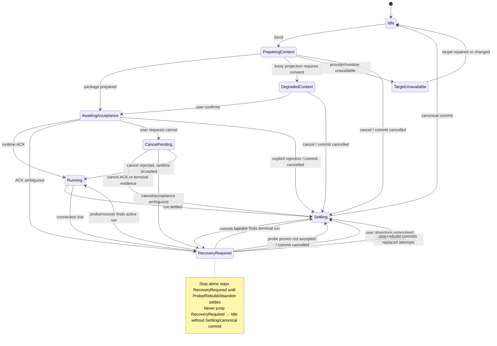

<!-- DOC-LIFECYCLE: active-architecture-reference -->
> [!IMPORTANT]
> **Lifecycle: Active architecture reference with historical execution sections.** Foundation decisions 仍被 current specs 使用；implementation checklist 与 wave 状态只保留历史证据。Current contract 以 [OpenSpec main specs](../../openspec/specs/README.md) 与代码为准。

# mossx 多 CLI × 多 Provider 会话基石设计

> 内容类型：Architecture Decision Record
> 生命周期：accepted / implemented in slices；原始 A–D 路线已归档，后续修复与收口 change 独立演进
> 初始日期：2026-07-27
> 最近校准：2026-08-22 · Shared-owned Native 侧栏泄漏收口（`fix-shared-owned-native-sidebar-leak`：live `thread/started` 按 Execution Target 认 pending；Qoder 终态 `qoder:<profile>:<raw>`；`ensureThread` 认 Shared-owned 而不靠 `parent.startsWith("shared:")`；hide 未就绪不放出新 grok/pi/qoder Index 行）。同日 · Qoder 进 Shared 支持集合（`enable-qoder-shared-target`：前后端双集合 + context/runtime-key/provisioning/send/interrupt 补臂 + canonical fact engine 枚举 + 四级 picker 目录；runtime-only 模型目录发送路径按空目录 + Allow 放行）。同日 · Qoder history 主通道切换：磁盘 jsonl primary（`~/.qoder/projects/<cwd-slug>/*.jsonl`，Grok/PI/Kimi NativeHistoryReader 形态）+ ACP `session/list`/`session/load` fallback；delete 仍走 ACP `session/delete`（红线 21 不变）。同日 · Qoder runtime contract 校准：requested model/reasoning effort fail-closed；cancel 先取 `stopReason:"cancelled"` typed terminal、仅 2s 后 kill 未结算 child；prompt `usage.inputTokens` / `outputTokens` 投影 unified usage；`forkSessionId` 路由 ACP `session/fork`；status/model probe 与 runtime 共用 resolved `home_dir`。同日 · Qoder 黄金 turn 补采（qodercli 1.1.28 + PAT 注入，probe6/7/8/9）：capability matrix `streaming.reasoning` / `streaming.tool-output` / `input.mid-turn` / `session.fork` 由 unknown 升 supported；cancel ACK 升级为实测（`stopReason:"cancelled"`）；ACP usage shape live（PAT 账号零值，非零值仍待实测）；`session.tree` 保持 unknown；仍不进 Shared。此前 2026-08-21 · Qoder 成为第 9 个 Native Engine（第四条协议族 `acp-stdio`，spawn-per-turn + ACP `session/resume`）；第一期不进 Shared；Spike 与校准行见下表 Qoder 条目。此前 2026-08-19 · DSH Composer 任务条 / 占用环接 host `session/projection`：`todos`、`contextPressure`、`contextBreakdown` 与 billed `tokenUsage` / `sessionStats` 独立 last-wins；空 `todos` 清空 standing plan。此前 2026-08-17：DSH Goal continuation：completed hop `turn/end` 不解绑；Goal `active` 抑制 `TurnCompleted`；`source.kind === "goal"` 投影为 `dsh-goal` 折叠卡。同日 Session Index 有界 DSH writer 入 first-paint。此前 2026-08-15：DSH 成为第 7 个 Native Engine（`dsh-host-rpc` + 全局 `dsh web` supervisor）；第一期不进 Shared；pending 晋升 / spawned host 退出回收 / 侧栏 workspace 成员集已按 L2 收口；校准行见下表 DSH 条目
> 适用范围：Native Session、Shared Session、Provider Runtime、Session Catalog、Sidebar Projection、未来 Plugin / Orchestration
> 核心决策：Native Session 保持原生身份；Shared Session 承担跨 CLI、跨 Provider 的逐 Turn 切换

---

## 零、当前实现校准

本文继续作为多 CLI 会话的 ADR。原始 Change A1–A3、B、C、D 已归档；截至 2026-08-06，Native/Shared 的后续修复、兼容、Phase 5 Squad 与 multi-agent collab 以 [OpenSpec main specs](../../openspec/specs/README.md)、对应 change 与代码为准，不应回写成「原路线未实现」。

| 契约面 | 当前代码事实 | 事实源 |
|--------|--------------|--------|
| Built-in engines | 9：Claude/Codex/Gemini/Grok/Kimi/OpenCode/PI/DSH/**Qoder** | `src/features/engine/engineIds.json`、`src/types/engine.ts` `EngineType`、`src-tauri/src/engine/mod.rs` `EngineType::Qoder` |
| Qoder protocol / runtime | 第四条 Builtin 协议族 `acp-stdio`，`executionModel: one-shot`（**spawn-per-turn**：`qodercli --acp` → initialize → `session/new` / `session/resume` / `session/fork` → requested `set_model`/`set_config_option` 成功后 → `set_mode bypassPermissions` → `session/prompt` → JSON-RPC response 即 typed terminal）；requested setting error fail-closed；cancel 发送 `session/cancel` 后保留 reader 等 typed response（2s watchdog 只 kill 原 turn 仍 active 的 child）；usage 只投影 `inputTokens` / `outputTokens`，不把 `_meta.quota` 当 billing；`inputAck: "first-event"`；第一期不进 Shared（picker disabled + reason） | `src-tauri/src/engine/qoder.rs`、`src-tauri/src/engine/adapter_registry.rs` `EngineProtocolFamily::AcpStdio`、`src/features/engine/engineIds.json`、OpenSpec `harden-qoder-native-runtime-contracts`、`docs/research/mossx-qoder-capability-spike.md` |
| Qoder identity / history / models | thread `qoder:<sessionId>` / `qoder-pending-<uuid>`；`session/new` / `session/fork` 均以真实 child sessionId 通过 `SessionStarted` 晋升（禁止双行 / 禁止伪造 id）；history 走**磁盘 jsonl primary + ACP fallback**：`list/load` 先读 `~/.qoder/projects/<cwd-slug>/<sessionId>.jsonl`（`encode_qoder_project_slug`，NativeHistoryReader 形态；readable empty JSONL 是 authoritative soft-empty；仅本地缺失、不可读或全损坏时回退 ACP），delete 仍走 ACP `session/delete`（红线 21：只读 vendor 文件）；模型目录 = ACP `models.availableModels` + `configOptions.reasoning_effort`，status/model/runtime 使用同一 resolved `home_dir`（runtime-only，不进静态 fallback roster）；权限 attach 后 `bypassPermissions` + `session/request_permission` 兜底 auto-approve，`fs/*` 限 workspace；未登录 → not-authenticated 诊断指向 `qodercli login` | `src-tauri/src/engine/{qoder,qoder_history,qoder_provider_profile}.rs`、`src-tauri/src/engine/status.rs` `detect_qoder_status_with_home`、`src-tauri/src/engine/commands.rs`、OpenSpec `harden-qoder-native-runtime-contracts` |
| DSH protocol / runtime | 第三条 Builtin 协议臂 `dsh-host-rpc`，`executionModel: persistent`；全应用一个 `dsh web`（adopt 已有 3080，否则 spawn；adopted 不杀） | `src-tauri/src/engine/adapter_registry.rs` `BuiltinEngineProtocol`、`src-tauri/src/engine/dsh/{host,supervisor,session,events,history}.rs`、OpenSpec `add-dsh-engine` |
| DSH identity / ACK | thread `dsh:<sessionId>` / `dsh-pending-<uuid>`；`session.create` 立即返回真实 sessionId；首轮在 prompt 前用 pending thread id 发 `SessionStarted`，mux bind 到 `dsh:<native>`；frontend `thread/started` + ACK cache 晋升，禁止双行。**terminal/ACK（2026-08-17）**：completed hop 只 notify waiter、不解绑；Goal `active` 抑制 `TurnCompleted`；`paused`/`complete`/clear 补发；`blocked` 发 TurnCompleted 但保持绑定；cancelled/error/interrupt/archive/shutdown 才 unbind。`source.kind === "goal"` 投影为 `dsh-goal` 折叠卡（空气泡、可见、默认可折叠）；其它 injected kinds 仍隐藏 | `src-tauri/src/engine/dsh/{mod,session,events,history}.rs`、`src/features/app/hooks/useAppServerEvents.ts`、`src/features/threads/hooks/useThreadTurnEvents.ts`、`src/features/threads/adapters/dshRealtimeAdapter.ts`、`src/features/threads/loaders/dshHistoryParser.ts`、`src/features/messages/components/context/DshGoalContextSummaryCard.tsx`、OpenSpec `adapt-dsh-goal-continuation`、`docs/research/mossx-dsh-capability-spike.md` |
| DSH host lifecycle / list | `ExitRequested` 只 `drop_host()` 杀 spawned；adopted 保留。侧栏 `list_dsh_sessions` 用 `workspace.create` 的 `sessionIds - archivedSessionIds`，禁止 cwd suffix / 空 cwd 全匹配；Session Index 有界 writer（`sync_dsh_engine` / `rows_from_dsh_summaries`）参与 first-paint 索引，host 不可达 soft-empty | `src-tauri/src/engine/dsh/supervisor.rs` `should_kill_host`、`src-tauri/src/lib.rs` `ExitRequested`、`src-tauri/src/engine/dsh/history.rs`、`src-tauri/src/session_index/{commands,writers}.rs`、`src/features/threads/hooks/useThreadActions.ts` |
| DSH models / config | 模型是 DSH `{provider,model}` 二元组，catalog 来自 `POST /api/llm.models`；mossx 不写 `$DSH_HOME` settings/credentials | `src-tauri/src/engine/dsh/mod.rs` `load_dsh_models`、`src-tauri/src/engine/dsh_provider_profile.rs`、`src-tauri/src/types.rs` `dshBin/dshHost/dshPort/dshAutoStart` |
| Native rendering projection | 七引擎各有 realtime adapter + history loader（DSH：`dshRealtimeAdapter` / `dshHistoryLoader`）。DSH Goal 注入走 `presentationMetadata` kind `dsh-goal`，不新增 ConversationItem kind，也不复用 Codex `/goal`。**DSH Composer 投影（2026-08-19）**：mux / history 接 `todos` / `contextPressure` / `contextBreakdown`；任务 pill 以 `dshTodos` 为权威（`[]` 清空，`null` 才回退 TodoWrite 扫描）；占用环分子=`projectedTokens ?? pressureTokens`，分母=`contextWindow`，三分类 heuristic 带 `~`；billed `tokenUsage` 不得冲掉占用 / todos | `src-tauri/src/engine/dsh/{events,history}.rs`、`src/features/app/hooks/useAppServerEvents.ts`、`src/features/threads/hooks/{useThreadsReducer,useThreadTurnEvents}.ts`、`src/features/threads/loaders/dshHistoryLoader.ts`、`src/features/composer/components/{Composer.tsx,ChatInputBox/ClaudeContextCard.tsx}`、OpenSpec `wire-dsh-todos-and-context-usage` |
| Shared target boundary | Claude/Codex/Kimi/Grok/OpenCode/PI/**Qoder**；Gemini **与 DSH** 排除（picker disabled + reason；禁止 normalize 成 claude 后写入 binding）。Qoder（2026-08-22 `enable-qoder-shared-target`）：Kimi 同档准入（typed terminal/cancel + 跨进程 resume + `session/list` probe 实测，spike §13/§14）；`inputAck: "first-event"` 弱语义；context 走 user channel（`strong_context_ack: false`）；canonical fact engine 枚举（TurnExecutionSnapshot / ProviderPrivateRef）同步加 `"qoder"` | `sharedSessionEngines.ts`、`src-tauri/src/shared_sessions.rs`、`src-tauri/src/shared_event_log/canonical/validator.rs`、OpenSpec `add-dsh-engine` / `add-qoder-engine` / `enable-qoder-shared-target` |
| Gemini runtime | registry 中存在，但 runtime policy 默认 disabled | `src-tauri/src/engine_policy.rs` |
| Provider selection | Native 原子选择；Shared 逐 Turn target | `close-native-session-provider-create-binding` 与 Shared target contracts |
| Shared send UI 状态机 | 九态 + Recovery Exit Ladder（Probe/Stop/停止并重建/放弃本轮） | `sendStateMachine.ts`、`SharedSendStatusBar.tsx`、`shared_session_v2.rs` |
| Recovery Exit Closure | **设计见 §14.5.7**；已实现并收口（OpenSpec `fix-shared-session-recovery-exit-closure`） | abandon durable + stop-before-rebuild + fuse disabled reasons |
| Shared 上下文续接 integrity | native 不可信时禁止假设 history 已在 native 内；zero-transfer 不等于可 rematerialize；`empty-context-handoff` 为一等 recovery 错误类别 | OpenSpec `fix-shared-context-resume-integrity`、`shared_context/compiler.rs`、`recoveryErrorMap.ts` |
| Atomic 模型↔思考强度联动 | reasoning options / effort 由 **target 模型 capability** 驱动，禁止用全局 `activeEngine` 档位冒充；Shared 初始化禁止回落 Native 思考档位 | `atomicModelReasoning.ts`、`initialTarget.ts`、OpenSpec `fix-shared-atomic-model-reasoning-linkage` |
| 用户附图 canonical 投影 | 用户附图单气泡投影，Shared 历史不丢图 | `shared_projection/projector.rs`、OpenSpec `fix-shared-user-image-bubble-projection` |
| create-session 默认目标 | create-session Atomic picker 为全部 Atomic 引擎（含 Grok/Kimi/OpenCode）seed 默认 ExecutionTarget，不仅 claude/codex | `resolveDefaultCreationExecutionTarget.ts` |
| Agent Squad V1 入口与形态 | 仅 Shared Session 显示 send 左侧 one-shot `Squad` button；plan/run card 留在 conversation，详情复用 SubAgent 右侧 full-height inspector host | `src/features/composer/components/Composer.tsx`、`src/features/squad-orchestration/**`、`ConversationInspectorSplit.tsx` |
| Squad control authority | Lead 只提出 structured Dynamic DAG；mossx validator、Canonical Fact、durable projection 与 command boundary 决定可否执行；同一 Shared Session 最多一个 active run | `src-tauri/src/squad_orchestration/{types,validator,projection,commands,plan_commands}.rs`、OpenSpec `add-shared-squad-control-plane` |
| Squad execution boundary | V1 为 Parallel Analyze + Single Writer；全部 Worker seal 到 Composer 当前 exact target。Codex 可执行完整 DAG；Claude 仅 pure read-only DAG；Kimi/Grok/OpenCode 因缺少可验证 hard read-only mode 在 Lead side effect 前 fail closed | `src-tauri/src/squad_orchestration/{scheduler,support}.rs`、`shared_session_v2.rs`、OpenSpec `add-shared-squad-worker-execution` |
| Squad mutation/recovery | workspace UUID + canonical root 双重归一；durable lease 无 time-based expiry；Git dirty baseline + Change Fence；Stop 先写 cancel intent，再 best-effort interrupt exact owner；禁止自动 rollback/reset/stash | `src-tauri/src/squad_orchestration/{scope,stop_commands}.rs`、`shared_event_log/writer.rs`、OpenSpec `harden-shared-squad-recovery` |
| Squad conversation projection | 所有 Worker turn（含 Synthesize）保持 nested-only；只有 successful `SquadRunSettled` 投影一次 top-level final；checkpoint incremental replay 不泄漏 Worker message | `src-tauri/src/shared_projection/projector.rs`、`src/features/squad-orchestration/runtime/squadConversationBridge.ts` |
| Multi-agent collab Runtime Context | **仅协作存在时**：`squad.nodeOutcomeRecorded.outcome.body`（capped）经 Context Compiler 投影为 portable assistant 条目；**禁止** destination-owned / squad-worker attempt 剔除吞掉 stage digest；collab control briefing user turn 可 omission | `agent_orchestration/commands.rs`、`shared_context/compiler.rs`、OpenSpec `fix-shared-collab-context-and-sidebar-spawn` |
| Multi-agent stage 执行 target | 每 stage `begin_stage_turn(&stage.target)` + squad worker bindingKey；本地 event log 核对 plan/claude、implement/codex、review/grok 分 binding **真实执行** | `agent_orchestration/{commands,support}.rs`、`shared_session_v2.begin_squad_worker_turn_core`、`shared-event-log-v2.sqlite3` |
| Multi-agent Inspector 流式与隔离 | 右栏 **禁止** `extractRealtimeTextDelta` 旁路；`agent-canvas:{shared}:{attemptId}` + 主幕同源 adapter / liveAssistantTextChannel；**幕布仅当前 attempt**；settle 只信本 stage `fullOutcome`；徽章 **强制对齐 stage.target**；activeTurn 查询用 **shared:** key 非 agent-canvas key | `useAppServerEvents.ts`、`agentCanvasThread.ts`、`useAgentStageTranscript.ts` |
| Composer Run Status Strip 数据源 | 输入框上方 pills（todo/subagent/plan/**已编辑**）对 Shared 普通与协作均生效；源 items = 当前会话主时间线 ∪ `agent-canvas:{shared}:*` ∪ parent=active 子会话；**不**把全量 items 绑回 AppShell 根 props（ActiveCanvas 隔离不变） | `collectRunStatusSourceItems.ts`、`Composer.tsx`、`ComposerRunStatusStrip.tsx`、OpenSpec `wire-shared-composer-run-status-strip` |
| Multi-agent 模板智能体 | 环节可选客户端智能体（`agentProvider` 同源）；persona 字段进 stageBindings；Inspector 头展示「· 智能体 {name}」；注入目前为 rolePrompt 前缀（非 Composer 全量 AGENT_PROMPT 协议） | `StageAgentPicker.tsx`、`templates/types.ts`、`AgentInspectorDrawer` |
| Shared Sidebar hidden binding | Shared 内部 native binding **永不**作为用户顶层会话展示。**Live 认主（2026-08-22）**：`thread/started` 按 Target（`engine + providerProfileId`）认 pending，禁止 engine-only 权威；认不唯一则不开 Native 行；Qoder 终态 `qoder:<profile>:<raw>`；`ensureThread` 命中 hide / pending-shared / 已登记 binding 即丢弃。**List hide**：hide set（fresh∪outer）+ control-plane 标题闸；hide 未就绪保留 last-good，不 full-show 新 grok/pi/qoder Index 行。**侧栏 title**：行首 `MOSSX_*`（兼容 `previewThreadName` 50 字截断）∪ 严格 classify ∪ collab worker；**幕布 transcript**：仍仅严格 `classifyContextProtocolText`（禁止 `includes("MOSSX")`） | `useAppServerEvents.ts` `resolvePendingSharedSessionBindingForTarget`、`canonicalQoderThreadId`、`isSharedOwnedNativeThreadId`、`buildNativeIndexEarlyPaintSummaries`、`stripHiddenSharedBindingSummaries`、OpenSpec `fix-shared-owned-native-sidebar-leak` / `fix-shared-collab-context-and-sidebar-spawn` |

本文中的 `RuntimeDeliveryAdapter`、`Canonical Fact`、`ContextPackage` 等名称既包含实现合同，也包含 ADR 概念层语言。读者需要复制代码或接新 CLI 时，必须同时使用 [Engine Onboarding Guide](./mossx-new-cli-onboarding-guide.md) 的「当前注册面」清单，不能只按概念接口猜文件名。

> **更新触发器**：engine registry、Shared 支持集合、provider binding、canonical fact schema、context compiler、terminal/ACK contract、**recovery exit / abandon**、Squad exact-owner / mutation lease / settlement projection、**collab stage digest → Runtime Context**、**Shared sidebar hide / spawn 闸**、**multi-agent Inspector attempt 隔离 / 徽章权威**、**Composer run-status 合成数据源** 变化。

## 一、Executive Summary

mossx 的长期基石不应是“把多个 CLI 放进同一个下拉框”，而应是一个稳定的多 Runtime 会话系统：

```text
Native Session
  = 固定 CLI
  + 固定 Provider Binding
  + 原生 CLI Session Identity
  + 原生 history / resume / fork / tools 语义

Shared Session
  = 一个 Canonical Shared Thread
  + 每个 Next Turn 可选择 Execution Target
  + Execution Target = CLI + Provider + Model + Reasoning
  + 每个 CLI + Provider 组合拥有独立隐藏 Native Binding
  + 通过 Context Package 在不同 Target 之间同步上下文
```

最终产品语义：

1. Native Session 在创建时选择 CLI 和 Provider，创建后绑定不可变。
2. Native Session 更换 Provider 时，不修改原会话，而是执行“使用其他 Provider 继续”，创建一个新的 `Provider Continuation`。
3. Shared Session 在每个 Turn 发送前允许切换 CLI、Provider、Model 与 Reasoning。
4. Shared Session 对用户始终只有一个会话；内部 Native Binding 不进入 Sidebar。
5. Subagent、User Fork、Provider Continuation、Shared Binding 是四种不同关系，不共用一种 Parent/Child 语义。
6. `parentThreadId` 只表达 Engine/runtime 权威的 Subagent ownership；用户血缘关系使用独立的 Conversation Family contract。
7. V1 持久化 Conversation Family 血缘，但 Sidebar 仍可先按带标签的顶层 Session 展示；数据模型与 UI Projection 解耦。
8. Shared Session 使用 Adapter 声明并经 Spike 证明的 authoritative logical terminal evidence；Provider typed final/result 到达时必须立即归一，process exit 仅在它被证明是该 CLI 唯一逻辑终态时可用，stdio、hook、MCP child 与 usage cleanup 不得阻塞 `run.settled`。
9. Canonical Fact 只能通过统一 Writer 生成 tagged envelope；业务模块不得手工构造另一套 payload serialization。
10. Shared history recovery 与 Native runtime recovery 分属不同 owner；Shared 不得回退到 Native resume，也不得显示 Native recovery card。
11. Shared durable identity 固定为 `session UUID`，前端 thread key 固定为 `shared:<UUID>`；标题只属于 presentation metadata。
12. 旧 canonical row 可以在 Projection decode boundary 做无损兼容，但不得改写 immutable payload 或 checksum。

一句话概括：

> Native Session 负责原生性与隔离；Shared Session 负责自由切换与编排；Context Compiler 负责把完整事实投影为目标 CLI 可消费的上下文。

---

## 二、为什么必须先做“会话基石”

### 2.1 四个概念不能混为一个字段

多 CLI 客户端至少存在四个独立维度：

| 维度 | 回答的问题 | 示例 |
|---|---|---|
| CLI / Engine | 谁在执行 Agent Runtime | Claude Code、Codex CLI、Kimi CLI |
| Provider | CLI 通过哪个配置与服务端通信 | Official、OpenRouter、Azure-compatible、Company Gateway |
| Model | 本 Turn 使用哪个模型 | `claude-opus-*`、`gpt-5-*` |
| Session | 对话、恢复、工具状态归谁所有 | Claude native session、Codex thread、Shared thread |

错误建模：

```text
selectedEngine = "claude-openrouter-opus"
```

这种做法会把 Runtime、认证、Model Catalog 和 Session Identity 压成一个字符串，随后出现：

- 换 Model 被误判为换 Session；
- 同一 CLI 的不同 Provider 共享错误 Runtime；
- 删除 Provider 后历史无法解释；
- Sidebar 无法表达会话来源；
- Usage Attribution 无法确定归属；
- Shared Session 切回旧目标时无法恢复原生上下文。

正确建模：

```text
Execution Target
  ├─ Engine
  ├─ Provider Profile
  ├─ Model
  └─ Reasoning
```

### 2.2 真正困难的不是 Picker

UI Picker 只是入口。系统真正要解决的是：

1. **Target Identity**：一次 Turn 到底由哪个 CLI、Provider、Model 执行。
2. **Runtime Ownership**：Process、Home、env、pending input、approval state 归谁。
3. **Context Ownership**：历史是 App 持有，还是外部 CLI 持有。
4. **Relationship Semantics**：Subagent、Fork、Provider Continuation 如何投影。
5. **Recovery**：重启后如何恢复相同 Target、Binding 和同步游标。
6. **Provenance**：历史中每个结果来自哪里。

如果这些边界不先稳定，Provider Picker 越早接入，后续返工越大。

---

## 三、从 pi 与 LiveAgent 提炼出的架构原则

### 3.1 学 pi：薄 Core，不复制 Feature

pi 的关键不是功能数量，而是 Core 只负责：

- Agent Loop；
- 标准事件；
- Session Log；
- 消息队列；
- 可注入 Hook；
- Provider/Protocol 抽象。

Permission Gate、Plan Mode、Subagent、Sandbox 等能力建立在这些决策点之上。

mossx 应采用同样分寸：

```text
Core 提供稳定事实与决策点
Feature 决定策略
Plugin 只能消费受控能力
```

Core 不负责猜测“哪个 CLI 更适合当前 Prompt”，也不负责静默切换 Provider。

### 3.2 学 pi-ai：Provider 与 Protocol 正交

pi-ai 将 Provider 与 API/Wire Protocol 分开：

```text
Provider
  = identity + endpoint + auth + model catalog

Protocol
  = request serialization + stream parsing
```

映射到 mossx：

```text
Provider Profile
  = providerProfileId + endpoint/auth/config + model catalog

Engine Protocol
  = claude stream-json
  | codex app-server JSON-RPC
  | kimi stream-json
  | future protocol
```

CLI 不是 Provider，Provider 也不是 Model。

### 3.3 学 pi-ai：Cross-Provider Handoff 先转换，不能默认先摘要

pi-ai 的 `packages/ai` 已经实现同一 Conversation 内跨 Provider/Model 切换。它保留统一 `Message[]`，发送前执行：

```text
Canonical Message History
        ↓
transformMessages(targetModel)
        ↓
Provider API Converter
        ↓
Target Wire Format
```

其关键兼容规则包括：

- 跨模型的普通 Thinking 转为 text，redacted/encrypted thinking 在目标不匹配时删除；
- 同模型需要 replay 的 thinking signature 保留；
- Tool Call ID 按目标 Provider 约束归一化，并同步更新 Tool Result 引用；
- Tool call/result 保持协议闭环，孤立 Tool Call 补 synthetic error result；
- 不支持 Vision 的目标把 Image 降级为明确 placeholder；
- `error` / `aborted` 的不完整 Assistant Message 不参与 replay；
- 最后由 Anthropic、OpenAI Responses、OpenAI Completions、Google、Mistral、Bedrock 等 Adapter 转成各自 Wire Format。

这证明：

> 对 **SDK/API Controlled Runtime**，不能直接重放的是 Provider 原始 Wire History；Canonical Portable History 应优先尝试兼容转换与完整 replay，Summary/Checkpoint 只应作为能力不兼容或 Context 超限后的降级路径。

pi-ai 的 `cross-provider-handoff.test.ts` 还使用真实 Provider 生成包含 Thinking、Tool Call 与 Tool Result 的历史，再交给其他 Provider 消费。mossx 的 Compatibility Transformer 也必须建立类似的 source × target matrix，不能只做单 Provider 单元测试。

但这个结论不能原样套到所有 Native CLI：

- pi-ai 自己构造目标 Provider 的 API Request，因此能保留 `user` / `assistant` / `tool` role 和 Tool Call/Result 关联。
- mossx 当前 Codex Adapter 只使用 `turn/start.input` 发送本次 user input 与 image；但本机 Codex CLI `0.144.6` 的 App Server 已提供 `thread/inject_items`，可以把 Raw Responses API Items 持久化进目标 Thread。能力已经存在，mossx 尚未接入。
- Claude CLI 当前通过 stream-json prompt 加 `--resume` / `--fork-session` 恢复自己的历史，不提供任意多角色历史导入。
- Kimi 当前 prompt Adapter 支持 native session resume，不提供任意历史导入；Kimi CLI 已支持 ACP，后续应优先评估 ACP Adapter，而不是继续扩展一次性 prompt wrapper。

因此，mossx 必须区分两种能力：

```text
SDK/API Controlled Runtime
  = 可以做真正的 Canonical Message Replay

Native CLI Runtime
  = 可以恢复自己的 Native History
  = 先按 Runtime Capability 判断 native history import / clone
  = 不支持 import 时才接收 user-channel portable transcript / checkpoint
```

`Compatibility Transformer` 仍然重要：

- 对支持 history import 的 Codex，产物可以是经过验证的 Responses API Items；
- 对不支持 import 的 Claude/Kimi prompt Adapter，产物是安全、带 provenance 的 transcript/checkpoint；
- Import capability 与 lossless fidelity 是两个维度：目标能接收结构化 Item，不代表 Provider-private reasoning/signature 可以无损迁移。

### 3.4 学 pi-chat：External Log、Delta Injection、On-demand Retrieval

`pi-chat` 不是通用多 Provider Chat SDK。它是一个 pi Extension，把 Discord/Telegram channel 连接到隔离的 pi Session，并为每个 channel 建立独立 Gondolin micro-VM。

它对 mossx 最有价值的不是 Chat Bridge，而是 Context 分层：

```text
channel.jsonl
  = 完整外部聊天事实源

Pi Session
  = 当前 Agent 可见上下文与 Compaction

每次触发
  = 只注入上次 completed trigger 之后的 transcript delta

chat_history
  = 旧历史按 text/date/limit 主动检索

memory.md
  = account-wide / channel-specific durable memory
```

这说明完整存储、当前窗口和长期记忆应该分离。mossx 可以对应为：

| pi-chat | mossx |
|---|---|
| `channel.jsonl` | Canonical Shared Log |
| completed trigger boundary | target-scoped sync cursor |
| transcript delta | Native Binding 增量注入 |
| `chat_history` | `context_history` / Artifact Retrieval Host Tool |
| account/channel `memory.md` | Workspace/Conversation durable facts |
| pi compaction | Binding-local Checkpoint/Compaction |

pi-chat 也提供一条重要边界：检索出来的历史被标记为 reference context，不能把旧内容中的 trigger/control command 当成新命令执行。mossx 的历史检索同样必须携带 provenance，并隔离控制语义。

### 3.5 学 pi：统一 AgentEvent

不同 CLI 的事件应先归一到 mossx 自有事件，再翻译给前端：

```text
CLI Native Event
      ↓
Engine Protocol Adapter
      ↓
MossxAgentEvent
      ├─ Frontend Sink
      ├─ Session Persistence Sink
      ├─ Orchestrator Sink
      └─ Plugin Hook Sink
```

最低事件面：

```typescript
type MossxAgentEvent =
  | { type: "run:start"; runId: string; target: TurnExecutionSnapshot }
  | { type: "turn:start"; runId: string; turnId: string }
  | { type: "message:delta"; turnId: string; delta: unknown; partial: unknown }
  | { type: "tool:start"; turnId: string; toolCallId: string; toolName: string }
  | { type: "tool:update"; turnId: string; toolCallId: string; partialResult: unknown }
  | { type: "tool:end"; turnId: string; toolCallId: string; isError: boolean }
  | { type: "turn:end"; runId: string; turnId: string }
  | { type: "run:settled"; runId: string; outcome: RunOutcome };
```

`run:settled` 是编排器唯一可靠的“彻底空闲”信号。不能把单个 `turn:end` 当作没有 Retry、Compaction 或排队消息的最终完成。

### 3.6 学 pi：append-only Log + consumer-side replay

会话关系、Target 选择、Handoff、Job 状态应记录为 append-only facts：

```text
事实只追加
状态由消费者重放计算
```

优点：

- 崩溃后可以恢复；
- 历史可审计；
- 不需要依赖易丢失的内存闭包；
- 多个消费者可构建不同 Projection；
- 错误修复可以重建 Projection，而不是修改历史。

### 3.7 学 LiveAgent，但不复制 LiveAgent

LiveAgent 切换 Provider 顺滑，因为：

- Conversation History 由应用统一持有；
- Agent Loop 由应用持有；
- Tool Registry 由应用持有；
- Provider 只是 HTTP Adapter。

mossx 管理的是真实 CLI Runtime。CLI 自己拥有部分：

- Native History；
- Tool State；
- Resume Identity；
- Provider-specific Runtime；
- Approval 与 User Input 状态。

因此 mossx 不应复制 LiveAgent 的“每次把完整 canonical history 重新序列化给 API”。

mossx 应保留 Native Runtime，并建立：

```text
多个隐藏 Native Binding
        +
Canonical Shared Thread
        +
Context Compiler / Context Package
```

---

## 四、双轨 Session 产品模型

### 4.1 Native Session

定义：

```text
Native Session
  = Engine
  + Provider Binding
  + Native Session ID
```

约束：

- Engine 创建后不可变。
- Managed Provider Binding 创建后不可变。
- Model 可以按 CLI 原生能力切换，不自动改变 Binding Identity。
- Provider 全局默认变化不得重路由已有 managed-bound Session。
- Resume、Fork、History、Usage 继续遵循对应 CLI 的原生语义。
- Provider 缺失或失效时 fail closed，不静默回退到 local/default。

Native Session 的价值是：

- 原生恢复；
- 原生工具链；
- 原生 Fork；
- Provider Runtime 隔离；
- 精确故障定位；
- 历史身份稳定。

### 4.2 Native Session 更换 Provider

Native Session 内不提供普通热切 Provider。

用户入口：

```text
使用其他 Provider 继续
```

执行语义：

```text
1. 用户选择新 Provider。
2. 系统冻结来源 Session 的 Target Snapshot。
3. 系统生成 target-aware Context Package。
4. 创建一个新的 Native Session。
5. 新 Session 绑定新 Provider。
6. 注入目标 CLI 可消费的 Model Projection。
7. 新 Session 显示“供应商续接”标签。
8. 原 Session 保留，不删除、不改写、不自动归档。
```

Provider Continuation 的来源是 Native Session，其事实源仍是 vendor history file，不是 Shared Canonical Event Log。步骤 3 必须通过 §9.1.1 的 `NativeHistoryReader` 读取来源历史，再交给 `ContextCompiler`；不得要求 Native Session 预先迁入 Shared Canonical Pipeline。

这不是 Subagent，也不是普通 Fork：

- Subagent 是 Agent/runtime 自动派生的执行单元。
- User Fork 是用户从某个历史节点分叉。
- Provider Continuation 是用户为了更换 Provider 而创建的续接会话。

### 4.3 Shared Session

定义：

```text
Shared Session
  = Canonical Shared Thread
  + Selected Execution Target
  + Hidden Native Bindings
  + Handoff / Sync State
```

Shared Session 的 Conversation Type 创建后不可变。

每个 Turn 发送前允许选择：

```text
Execution Target
  = Engine
  + Provider Profile
  + Model
  + Reasoning
```

约束：

- 一个 Turn Attempt 只能绑定一个 Target。
- 正在运行的 Turn 不得中途换 Target。
- Picker 变化只影响 Next Turn。
- 不根据 Prompt 自动路由。
- Target 失败时不得静默 Fallback。
- 切回旧 Target 时复用旧 Hidden Binding。
- 所有用户和 Assistant 消息仍进入同一个 Canonical Shared Thread。

### 4.4 Shared Session 为什么不会污染 Sidebar

Shared Session 对用户只显示一条：

```text
跨模型实现登录                  Shared · Codex/OpenAI
```

内部可能有：

```text
Shared Session
├─ Claude / Official Binding
├─ Claude / OpenRouter Binding
├─ Codex / OpenAI Binding
└─ Codex / Azure Binding
```

这些 Binding：

- 属于 Shared Session Runtime Internal；
- 不进入 Native Session Sidebar；
- 不参与 Native Folder Assignment；
- 不作为独立用户会话打开；
- 只通过 Shared Session Identity 恢复。

---

## 五、核心领域模型

### 5.1 ExecutionTarget

```typescript
interface ExecutionTarget {
  engine: EngineType;
  providerProfileId?: string;
  modelCatalogEntryId?: string;
  /** 传给 CLI/API 的 runtime model；不得写 UI-only catalog id。 */
  model?: string;
  reasoning?: ReasoningSelection;
}
```

这是“下一 Turn 要发给谁”的可变选择。

它不是 Runtime Owner Key，也不是历史事实。发送时必须生成不可变 Snapshot。

### 5.2 TurnExecutionSnapshot

```typescript
interface TurnExecutionSnapshot {
  engine: EngineType;
  providerProfileId?: string;
  /** 选择时的 catalog identity；用于 provenance 与 exact pair validation。 */
  modelCatalogEntryId?: string;
  providerProfileNameSnapshot?: string;
  providerProfileSource?: ProviderProfileSource;
  /** 该 Attempt 实际执行的 runtime model。 */
  model?: string;
  reasoning?: ReasoningSelection;
  runtimeCapabilityFingerprint?: string;
}
```

规则：

- 每个 Turn Attempt 创建一次后不可变。
- Provider 显示名保存 Snapshot，避免 Provider 删除后历史不可解释。
- Model catalog entry identity 与 runtime model 必须分域；immutable Turn fact 同时冻结
  `modelCatalogEntryId` 与 runtime `model`，用于 provenance 与 exact pair validation；
  CLI/API actual-send 只消费 runtime `model`。
- Usage、Error、Retry、Recovery 全部绑定 Snapshot。
- `nativeSessionId` 属于 `NativeSessionBinding` / `SharedTargetBinding`，不属于 Target Snapshot；Lazy Create 在 Tx 2b 获得 Identity 后只更新 Binding，不 backfill Snapshot。
- UI 不能用“当前 Picker 值”解释历史 Turn。

Retry/Regenerate 使用两层 Identity：

```text
logicalTurnId
  = 同一次用户意图及其回答 variants

attemptId
  = 一次具体 Runtime execution
  = 恰好一个 TurnExecutionSnapshot
```

普通发送创建新的 `logicalTurnId + attemptId`；Retry/Regenerate 复用 `logicalTurnId`，创建新的 `attemptId`。

### 5.3 NativeSessionBinding

```typescript
interface NativeSessionBinding {
  engine: EngineType;
  providerProfileId?: string;
  nativeSessionId: string;
  ownerWorkspaceId: string;
  availability: "available" | "unavailable";
}
```

Native Session 的 Binding Identity：

```text
Engine + Provider Profile + Native Session ID
```

Native Session 不允许通过修改字段把 Binding A 变成 Binding B。

### 5.4 SharedTargetBinding

```typescript
interface SharedTargetBinding {
  bindingKey: string;
  sharedSessionId: string;
  engine: EngineType;
  providerProfileId?: string;
  nativeSessionId?: string;
  contextCursor: BindingContextCursor;
  availability:
    | "provisioning"
    | "ready"
    | "missing-provider"
    | "missing-runtime"
    | "degraded"
    | "recovery-required";
}

interface BindingContextCursor {
  acceptedThroughSequence?: number;
  committedThroughSequence?: number;
  pendingDelivery?: {
    packageId: string;
    sourceChecksum: string;
    throughSequence: number;
    startedAt: number;
  };
}
```

推荐 Binding Key：

```text
Engine + Provider Profile
```

Model 默认不进入 Binding Key。

原因：

- 同一 CLI + Provider 下换 Model 通常不要求创建新 Native Session。
- 若把 Model 加入 Key，每换一次 Model 都会制造新 Binding。
- 个别 CLI 如果要求换 Model 必须新 Session，应通过 Capability 特判。

### 5.5 SessionOrigin

```typescript
type SessionOrigin =
  | { kind: "root" }
  | {
      kind: "subagent";
      parentSessionId: string;
      agentRole?: string;
      spawnedByToolCallId?: string;
    }
  | {
      kind: "user-fork";
      sourceSessionId: string;
      sourceTurnId?: string;
    }
  | {
      kind: "provider-continuation";
      sourceSessionId: string;
      sourceProviderProfileId?: string;
    }
  | {
      kind: "shared-binding";
      sharedSessionId: string;
    };
```

`SessionOrigin` 解释对象如何产生；Conversation Family 解释用户会话血缘。两者不可合并：

```typescript
interface ConversationFamilyRef {
  familyId: string;
  familyRootSessionId: string;
  lineageParentSessionId?: string;
  lineageKind: "root" | "user-fork" | "provider-continuation";
  lineageDepth: number;
}
```

推荐边界：

- Root、User Fork、Provider Continuation 属于同一个 Conversation Family。
- Subagent 是 runtime-owned execution child，不进入 Conversation Family。
- Shared Binding 是内部执行对象，不进入 Conversation Family。
- Shared Session 自身可以作为独立 Family Root，但其 Hidden Binding 不继承 Family。
- 历史 Session 没有 authoritative lineage 时，以自身 stable session key 建立独立 Family，禁止按标题、时间或相似内容猜测血缘。

关键边界：

```text
parentSessionId
  = Runtime ownership
  = Subagent Sidebar tree

lineageParentSessionId
  = Conversation Family lineage
  = Fork / Provider Continuation audit
  = V1 不触发 Sidebar nesting

sharedSessionId
  = Hidden binding ownership
  = 不进入用户可见 Sidebar
```

现有 `sourceSessionId` 可作为 migration input 与兼容读取字段，但新写入以 `ConversationFamilyRef` 为 authoritative contract。完成迁移前执行 dual-read；不得把 `sourceSessionId` 改写为 `parentThreadId`。

### 5.6 ContextPackage 与 ProjectionManifest

```typescript
type ContextSourceRef =
  | {
      kind: "shared-canonical";
      sessionId: string;
      fromEntryId?: string;
      throughEntryId: string;
    }
  | {
      kind: "native-history";
      sessionId: string;
      nativeSessionId: string;
      readerId: string;
      fromCursor?: string;
      throughCursor: string;
      sourceFingerprint: string;
    };

interface ContextPackage {
  schemaVersion: 1;
  packageId: string;
  source: ContextSourceRef & {
    target: TurnExecutionSnapshot;
  };
  destination: {
    sessionId?: string;
    target: ExecutionTarget;
    binding?: {
      bindingKey: string;
      nativeSessionId?: string;
    };
  };
  checkpoint: {
    goal: string;
    constraints: string[];
    progress: {
      done: string[];
      inProgress: string[];
      blocked: string[];
    };
    keyDecisions: string[];
    nextSteps: string[];
    criticalContext: string[];
  };
  deterministicFacts: ContextFact[];
  portableTurns: PortableTurn[];
  atomicToolExchanges: AtomicToolExchange[];
  artifactRefs: ArtifactRef[];
  compression: ContextCompressionReport;
  projection: ProjectionManifest;
}

// 压缩可观测性：为 degraded-context UI 与编译审计提供量化依据
//（参考 Headroom 的 before/after token 统计；只记录实测值，不引入其反事实估计模型）。
interface ContextCompressionReport {
  sourceTokens: number;
  packageTokens: number;
  perType: Array<{
    category: string; // tool-outcome | code | log | image | portable-turn | ...
    sourceTokens: number;
    packageTokens: number;
    strategy: "passthrough" | "deterministic-fold" | "artifact-ref" | "omitted";
  }>;
}

interface ProjectionManifest {
  compilerVersion: string;
  mode:
    | "native-delta"
    | "native-history-import"
    | "native-history-clone"
    | "portable-transcript"
    | "checkpoint";
  includedEntryIds: string[];
  omitted: Array<{
    category: string;
    reason: string;
    retrievableRef?: string;
    disposition: "retrievable-on-demand" | "not-retrievable";
  }>;
  cursorSemantics: {
    advancesAcceptedCursorOnAck: true;
    omittedEntriesWillNotAutoReplay: true;
  };
  sourceChecksum: string;
}
```

`packageId` 必须覆盖 compiler version、destination identity、runtime capabilities、
effective budget、Binding 与 source range/checksum；任一会改变 projection/delivery 语义的
输入变化都必须产生新 identity。Artifact checksum 绑定 deterministic serialized
`ContextPackage` payload，读取时重算，不能复用 source checksum 代替 payload integrity。

`AtomicToolExchange` 必须把 tool call 与对应 result 当成不可拆分单元。`ArtifactRef` 指向文件、附件、长 Tool Result 或外部产物；优先传稳定引用，需要时再按权限读取内容。

`destination.binding` 是 Compiler/Delivery identity，不是 Target Snapshot。`native-delta` 必须提供 `bindingKey + nativeSessionId`；新 Binding 或 Provider Continuation 在 Identity 尚未创建时可以省略，但不得选择 `native-delta`。系统同时维护 durable `attemptId → bindingKey → nativeSessionId` lookup，供 provenance ownership 判定与 Recovery 使用。

Context 数据分成三层：

1. Canonical Log：完整、append-only 的存储事实，不因模型窗口裁剪。
2. Context Package：可审计、可重放、带 source cursor 的结构化交接包。
3. Model Projection：`ContextCompiler` 针对目标 CLI/Provider/Protocol 生成的有界输入。

`acceptedThroughSequence` 与 `committedThroughSequence` 不能合并成一个 `lastSynced`：

- `accepted`：目标 CLI 已确认接收输入；防止 Retry 重复注入。
- `committed`：该输入对应的 Terminal Turn Fact 已落入 Canonical Log；用于恢复与审计。
- `pendingDelivery`：App 在 ACK 边界崩溃时保存幂等恢复证据。

一次 Run 失败并不代表 Prompt 没进入 Native History。若已经收到 acceptance ACK，必须推进 `accepted`；否则 Retry 会把同一 Context Package 再灌一次。

`checkpoint` 是显式 lossy mode：目标 ACK 后仍推进 `acceptedThroughSequence`。Manifest 中被 omit 的 Entry 不会在后续普通 delta 中自动补发；消费者只能通过 `retrievableRef` 做 progressive retrieval。若内容不可检索，必须写 `disposition = "not-retrievable"` 并在用户确认降级前可见。这个 ceiling 换取 exactly-once delivery，不能用回退 Cursor 的方式补偿。

---

## 六、Session Relationship 与现有子会话隔离

### 6.1 四种关系不是同一种“Child”

| 类型 | 创建者 | Sidebar | Parent 字段 | 主要用途 |
|---|---|---|---|---|
| Subagent | Engine/runtime | 嵌套在 Parent 下 | `parentSessionId` | Agent 协作执行 |
| User Fork | 用户 | 顶层 Session | `lineageParentSessionId` | 从历史节点分叉 |
| Provider Continuation | 用户 | 顶层 Session | `lineageParentSessionId` | 更换 Provider 后继续 |
| Shared Binding | Shared Runtime | 不可见 | `sharedSessionId` | Shared 内部执行 |

### 6.2 Subagent

现有行为保持不变：

- Claude/Codex runtime 提供 authoritative relationship。
- 子会话保留自己的 canonical identity。
- Sidebar 嵌套展示。
- 显示 `子代理` 标签与 Agent role。
- Parent Turn settlement 与 Child 状态分别处理。

禁止：

- 按相同标题合并 Subagent。
- 把 Child canonical id 改写成 Parent id。
- 把 User Fork 或 Provider Continuation 写入 Subagent relationship writer。

### 6.3 User Fork

现有行为保持不变：

- 用户主动创建。
- 顶层 Conversation。
- Parent 保留。
- Child 首次发送后迁移到 canonical identity。
- 不显示 `子代理` 标签。

第一阶段 User Fork 的 source 仅允许 Native Session。Shared Session 保持 strictly linear，不支持从历史 Turn fork；否则必须先定义 Canonical Branch、Cursor 继承、Hidden Binding clone/replay 与 Projection lineage，不能复用 Native Fork 语义暗中实现。

建议增加 `Fork` Origin 标签，但不改变既有生命周期。

### 6.4 Provider Continuation

Provider Continuation：

- 用户主动创建。
- 顶层 Conversation。
- 使用新的 Provider Binding。
- 来源 Session 保留。
- 通过 Conversation Family 与 Context Package 可追溯。
- 继承来源 Session 的 `familyId`，并把来源写入 `lineageParentSessionId`。
- 不获得 `parentThreadId`。
- 不触发 Parent/Child Sidebar Tree。

硬约束：

> `Provider Continuation` MUST NOT 写入 Subagent relationship writer，MUST NOT 使用 `parentThreadId` 触发子代理树投影。

### 6.5 Shared Binding

Shared Binding：

- 只由 Shared Session 创建。
- 第一次向 Target 发送时 Lazy Create。
- 切回相同 Target 时复用。
- Native Process 可释放，Binding Metadata 保留。
- 不进入 Native Catalog 可见投影。
- 不显示 Origin/Provider 标签。

---

## 七、Sidebar Projection 与标签系统

### 7.1 标签分层

Sidebar 标签分三类：

1. **Conversation Type**：`Shared`。
2. **Execution Identity**：CLI、Provider。
3. **Origin**：`子代理`、`Fork`、`供应商续接`。

示例：

```text
重构登录模块                    Claude · Official
验证边界条件                    子代理 · Explore
重构登录模块                    Fork · Claude · Official
重构登录模块                    供应商续接 · Claude · OpenRouter
跨模型实现登录                  Shared · Codex/OpenAI
```

### 7.2 标签优先级

Sidebar 空间有限时：

```text
Origin > Conversation Type > Engine > Provider > Model
```

解释：

- Origin 决定用户是否会误解关系。
- Shared 必须与 Native 明确区分。
- Engine 是执行主体。
- Provider 用于隔离与排错。
- Model 变化频率高，不建议默认占 Sidebar 空间。

推荐展示：

| Session | 主标签 | 次标签 |
|---|---|---|
| Native Root | Engine | Provider |
| Subagent | 子代理 + role | Engine |
| User Fork | Fork | Engine + Provider |
| Provider Continuation | 供应商续接 | Engine + Provider |
| Shared | Shared | 当前 Engine/Provider |

### 7.3 V1 持久化 Conversation Family，Sidebar Projection 可延期

Provider Continuation 如果全部自动嵌套，容易与现有 Subagent Tree 冲突。

因此 V1 必须区分“数据 contract”与“展示形态”：

- 数据层立即持久化 `familyId`、`familyRootSessionId`、`lineageParentSessionId`、`lineageKind` 与 `lineageDepth`。
- Provider Continuation 与 User Fork 继承来源 Family。
- Sidebar 第一阶段仍可将它们作为带 Origin 标签的顶层 Session 展示。
- 详情或 Context Menu 提供“查看来源会话”和“查看同一 Conversation Family”。
- `lineageParentSessionId` 不产生 Subagent Tree，也不复用 `parentThreadId`。

后续可独立增加：

```text
Conversation Family Projection
```

该 Projection 只能读取 authoritative Family fields，不能复用 Subagent Tree，也不能按标题推断关系。这样即使第一阶段不做折叠 UI，也不会留下不可迁移的数据债。

### 7.4 Shared Session 的动态标签

Shared Sidebar Row 可以显示当前 Next Turn Target：

```text
Shared · Claude/OpenRouter
```

但历史解释必须使用 Turn Snapshot：

```text
Turn 1 · Claude/Official
Turn 2 · Codex/OpenAI
Turn 3 · Claude/OpenRouter
```

当前 Picker 变化不得重写过去 Turn 的标签。

---

## 八、Shared Session 多 CLI × Provider 执行流程

### 8.0 当前实现审计：可以重建，不应继续堆补丁

当前 Shared Session 已验证了“一个逻辑会话绑定多个 Native Session”的产品方向，但数据面不足以承载多 CLI × 多 Provider：

| 当前实现 | 事实 | 问题 |
|---|---|---|
| `SharedSessionMeta.bindings_by_engine` | Binding 只按 Engine 建索引 | 同一 Engine 的多个 Provider 会发生身份碰撞 |
| Shared Codex Binding | 创建时未传 `provider_profile_id` | 实际落到 disk/default Provider |
| Shared Claude Send | `provider_profile_id` 传 `None` | Shared Turn 没有 managed Provider routing |
| `MAX_DELTA_SYNC_TURNS = 8` | 只取最多 8 个 Turn | 长会话连续性依赖偶然命中最近窗口 |
| `MAX_DELTA_SYNC_CHARS = 4000` | 只生成 bounded text prefix | Tool、Artifact、Attachment、Decision 等事实丢失 |
| `build_delta_sync_prefix` | 只读取 user/assistant message text | 无法表达 Reasoning、Tool Exchange 与结构化错误 |
| `sync_shared_session_snapshot` | 前端把 `itemsByThread` 展示快照写入 JSONL | Presentation Model 被误当成 Canonical Fact |
| `ConversationItem` | 文本和 Tool Output 存在截断 | 无法承担 lossless replay 或崩溃恢复 |
| `last_synced_turn_seq` | Send 返回后直接推进 | 混淆“已接收”和“已完成/已持久化” |

关键源码锚点：

- [`shared_sessions.rs`](../../src-tauri/src/shared_sessions.rs)：Shared metadata、Hidden Binding、bounded delta、snapshot 与 send。
- [`useThreads.ts`](../../src/features/threads/hooks/useThreads.ts)：从前端 `itemsByThread` 触发 Shared snapshot。
- [`conversation.ts`](../../src/types/conversation.ts)：当前 Presentation Item contract。
- [`threadItems.ts`](../../src/utils/threadItems.ts)：展示项文本、Tool Output 与 Image 的裁剪。
- [`codex_core.rs`](../../src-tauri/src/shared/codex_core.rs)：Codex `turn/start.input` 的输入边界。
- [`claude.rs`](../../src-tauri/src/engine/claude.rs)：Claude prompt 与 native resume/fork 边界。
- [`kimi.rs`](../../src-tauri/src/engine/kimi.rs)：Kimi prompt 与 native session 边界。

结论：

> 当前 Shared Session 适合保留产品入口与 Session Identity，不适合保留其持久化和同步内核。V2 应以 Canonical Event Log 为地基重建；V0 snapshot 仅作为 Legacy Import Source。

### 8.1 Picker

建议 Picker 层级：

```text
CLI
└─ Provider
   └─ Model
      └─ Reasoning
```

用户选择只更新：

```text
selectedExecutionTarget
```

不创建 Binding，不发送消息。

#### 8.1.1 Picker 的产品可达性与加载契约

四级 Target 不能只存在于 domain type，必须在 Shared Composer 中可实际操作：

```text
打开模型菜单
  → 显示所有已知 CLI（支持 / 不支持都可解释）
展开某个 CLI
  → 显示该 CLI 的 Provider Profiles
  → 按 engine + providerProfileId 懒加载各自 Model Catalog
选择 Model
  → 原子写入 engine + providerProfileId + model
  → Reasoning 仅在同一 Binding 下保留，否则清空
```

硬约束：

- 根菜单打开不得预取所有 Provider 的全部 Model；只允许 user-driven、binding-scoped
  lazy load，并按 `engine + providerProfileId` cache / dedupe。
- local/disk sentinel 只属于配置查询边界；写入 `ExecutionTarget` 前必须归一为
  `providerProfileId = null`，避免与 canonical `engine:default` 形成双 Binding。
- 当前按钮的 Model label 必须从完整 Target 对应 catalog 解析，不能继续读取切换前
  Engine 的 model list。
- 已知但未验证 target acceptance 的 CLI 必须显示 disabled reason；禁止静默隐藏，
  也禁止点击后 fallback 到其他 CLI。
- Provider catalog 部分失败只影响该 binding；不能清空其他 CLI/Profile 的可用目录。

### 8.2 Send

```text
1. 读取 selectedExecutionTarget。
2. 解析 Provider Availability。
3. 解析 Provider-scoped Model Catalog。
4. 固化 TurnExecutionSnapshot。
5. 先 Commit `conversation.turnRequested`，确保 User Intent Durable。
6. 查找 Engine + Provider 对应 Hidden Binding；不存在时先 Commit `BindingProvisioningState(prepared)`，再调用 Runtime 创建 Native Session。
7. 收到 Native Session Identity ACK 后把 Binding 更新为 `ready`；ACK 不确定则进入 `recovery-required`，禁止盲目再建。
8. 根据 BindingContextCursor 由 ContextCompiler 生成 target-aware Context Package。
9. Commit `context.deliveryPrepared` 与 `pendingDelivery`。
10. Runtime-specific Adapter 执行 History Import / Transcript Prefix / Prompt Send。
11. 收到明确 Context ACK 后 Commit `context.deliveryAccepted` 并推进 `acceptedThroughSequence`。
12. 收到明确 Prompt ACK 后 Commit `conversation.turnAccepted`。
13. Run/Turn Assembler 在 Terminal 时生成 authoritative `conversation.turnCommitted`。
14. Canonical Commit 成功后推进 `committedThroughSequence` 并清理 pending delivery。
```

### 8.3 Switch Back

场景：

```text
Claude/Official
→ Codex/OpenAI
→ Claude/Official
```

系统只持有两个 Hidden Binding：

```text
Binding A = Claude/Official
Binding B = Codex/OpenAI
```

第三个 Turn 恢复 Binding A，并把 Binding A 离开期间的 Shared Context 编译为 `native-delta` 投影后注入。

不会创建第三个 Native Binding。

### 8.4 失败语义

- Provider 不存在：阻止发送，保留 Picker 选择并显示 unavailable。
- Model 不属于 Provider Catalog：阻止发送，不改用默认 Model。
- Model catalog `id != model` 时，Target 必须同时冻结两种 identity，execution 只使用
  runtime `model`；backend 在 Target side effect 前 fail closed 校验。
- Native Binding 恢复失败：显示 recoverable error，允许显式重建 Binding。
- Turn 失败：保留原 Target Snapshot，不自动重路由。
- Context compile 失败：不写 `pendingDelivery`，不推进任何 Cursor；以 failed outcome Commit 当前 Attempt，Retry 创建新 Attempt。
- 投递前失败：清理 `pendingDelivery`，不推进 `accepted`。
- acceptance ACK 明确成功：推进 `accepted`；后续 Turn 失败也不回退，避免重复 Prompt。
- acceptance ACK 不确定：保留 `pendingDelivery`，先探测 Native History/run identity，再决定 Retry。
- Probe 发现与当前 delivery/bootstrapping 对应的结构化 Provider/API rejection 时，强负
  evidence 必须覆盖 marker、已落盘 user entry、process error 与无关 stderr warning；
  operation 不得进入 ready。
- acceptance ACK 不确定期间锁定整个 Shared Session Composer；不得通过切换 Target 绕过线性顺序。
- Canonical Commit 失败：不推进 `committed`，进入可恢复状态；不得丢弃已接受的 Native Run。
- 降级 Context：只有用户能看到 fidelity/omissions 时才允许发送，不得假装完成无损同步。

---

## 九、Context Ownership 与 Context Compilation Protocol

### 9.1 Canonical Shared Thread 是用户事实源

Shared Session 的用户可见事实源：

```text
Canonical Shared Thread
```

Hidden Native Session 只是执行 Backend，不是用户会话真相。

Canonical Thread 应保存：

- User Message；
- Assistant Message；
- Portable Content Blocks；
- 完整结构化 Tool Call/Result pair；
- Provider-private Block 的原始引用与可移植投影；
- TurnExecutionSnapshot；
- Handoff Reference；
- Error/Recovery Fact；
- Attachment Reference；
- Usage Attribution Fact。

但“完整”是指完整的 Canonical Facts，不是保存每个 streaming delta，也不是复制 Native CLI 的 vendor history file。

推荐写入链路：

```text
User Send
      ↓
SQLite Event Writer
      ↓
conversation.turnRequested（side effect 前）
      ↓
Runtime Delivery
      ↓
Native CLI Event
      ↓
Engine Adapter / MossxAgentEvent Ingress
      ↓
Run / Turn Assembler（fan-out/drop 之前）
      ↓
conversation.turnCommitted（critical authoritative fact）
      ↓
现有 MossxAgentEvent Bus Critical Lane
      ↓
Shared Canonical Event Log V2 Commit Sink
      ├─ UI Projection
      ├─ ContextCompiler
      ├─ Recovery Projection
      └─ context_history / Artifact Retrieval
```

现有 [`agent_event_bus.rs`](../../src-tauri/src/engine/agent_event_bus.rs) 应复用，不再创建第二套 Event Bus。但它当前存在 coalesce/drop delivery 语义，因此不能把普通订阅流直接当成持久化真相：

- streaming delta 可以合并或丢弃；
- Normal lane 满载时允许 drop，当前 `tool.started` / `tool.completed` 也位于该 lane；
- Assembler 必须位于 fan-out/drop 之前，或从 Runtime Lifecycle Owner 的 authoritative final snapshot 组装；
- Canonical Persistence 只消费 critical `conversation.turnCommitted` final fact；
- `conversation.turnCommitted` 必须在现有幂等 `run.settled` 边界生成并以可靠路径落盘。
- Event Bus `publish = true` 只表示进程内投递，不表示 Durable Commit；`settling → idle` 必须等待 `SharedEventWriter` 的 SQLite transaction ACK。

Event envelope 至少包含：

```typescript
interface SharedCanonicalEntry<TFact = unknown> {
  schemaVersion: 2;
  entryId: string;
  logicalSessionId: string;
  sequence: number;
  occurredAt: number;
  factType: string;
  fact: TFact;
  payloadChecksum: string;
  provenance: {
    engine?: EngineType;
    providerProfileId?: string;
    bindingKey?: string;
    nativeSessionId?: string;
    runId?: string;
    turnId?: string;
  };
  fidelity: "canonical" | "presentation-only";
}

```

完整 Turn Fact Lifecycle 与字段 contract 见 §14.2。

`UI Projection` 可以裁剪，Canonical Commit 不可以。Renderer 必须从 Canonical Fact 派生，不能反向把 UI Item 作为事实源。

#### 9.1.1 NativeHistoryReader：Provider Continuation 的只读 Source Adapter

Native Session 不建立 Shared Canonical Event Log，但 Provider Continuation 仍需要稳定、可审计的 source。为此增加 read-only anti-corruption layer：

```typescript
interface NativeHistoryReader {
  readerId: string;
  probe(source: NativeHistorySource): Promise<NativeHistoryCapability>;
  read(request: NativeHistoryReadRequest): Promise<NativeHistoryReadResult>;
}

interface NativeHistorySource {
  sessionId: string;
  nativeSessionId: string;
  engine: EngineType;
  providerProfileId?: string;
}

interface NativeHistoryCapability {
  readable: boolean;
  stableCursor: boolean;
  currentThroughCursor?: string;
  supportedEntryTypes: string[];
  unsupportedReason?: string;
}

interface NativeHistoryReadRequest {
  source: NativeHistorySource;
  fromCursor?: string;
  throughCursor: string;
}

interface NativeHistoryReadResult {
  sourceFingerprint: string;
  fromCursor?: string;
  throughCursor: string;
  entries: ContextSourceEntry[];
  fidelity: "native" | "semantic" | "lossy";
  omissions: ProjectionManifest["omitted"];
}

interface ContextSourceEntry {
  sourceEntryId: string;
  occurredAt?: number;
  role: "user" | "assistant" | "tool" | "control";
  blocks: ContextFact[];
  provenance: {
    engine: EngineType;
    providerProfileId?: string;
    nativeSessionId: string;
    nativeTurnId?: string;
    vendorEntryType?: string;
  };
  fidelity: "native" | "semantic" | "lossy";
}

interface NativeHistoryMaterialization {
  operationId: string;
  source: NativeHistorySource;
  readerId: string;
  sourceFingerprint: string;
  throughCursor: string;
  normalizedEntriesChecksum: string;
  normalizedEntriesArtifactRef: ArtifactRef;
  contextPackageId: string;
  contextPackageChecksum: string;
  contextPackageArtifactRef: ArtifactRef;
  preparedAt: number;
}
```

Contract：

- Claude Reader 解析 session JSONL，Codex Reader 解析 rollout，Kimi Reader 只读取其公开/稳定 History surface。
- 输出是 canonical-shaped `ContextSourceEntry`，只用于 `ContextCompiler`；它不是 `SharedCanonicalEntry`，不分配 Shared sequence，也不写 Shared Event Log。
- Reader 必须保持 source order、stable cursor、source fingerprint、Tool Call/Result pairing 与 provenance；无法保真的内容进入 omissions。
- Provider Continuation 只接受 `stableCursor = true` 且存在 `currentThroughCursor` 的 Reader。缺少稳定快照边界时 typed unsupported、fail closed；第一阶段不做“边读边增长”或猜测式 materialization。
- Reader 必须在分配 source-sized buffer 前检查 byte limit；当前实现单文件上限为
  `64 MiB`，超限返回 typed `source-too-large`。probe/read 与 recovery file scan 在
  blocking worker 执行，禁止阻塞 async runtime worker。
- portable projection 使用 allowlist：只允许 text 与完整 Tool Call/Result pair。
  private reasoning/signature、encrypted/redacted、unknown 与不完整 Tool exchange 进入
  typed omissions，不得透传 vendor private payload。
- 系统先以 Probe 得到 `currentThroughCursor`，再按该上界读取。编译完成后、创建目标 Native Session 或发送任何 Context 前，必须先把 normalized entries 与完整 Context Package 写入 Artifact Store（temp file + atomic rename），再在同一 preparation transaction 中 Durable Commit immutable `NativeHistoryMaterialization` refs/checksums；Retry 从 Artifact Ref 重放，不重新读取漂移中的来源。
- Materialization 后若来源 History 继续增长，不影响本次 Continuation；用户需要更新内容时创建新的 Continuation operation。
- 来源 Session 删除、权限变化或 Reader 升级不影响已 prepared operation。Artifact 在 Continuation terminal settlement 与 retention window 结束前不得 GC；启动恢复发现 ref 缺失/checksum 不符时，若 operation 已触发 target side effect，进入 explicit recovery error，禁止重读来源后假装是同一 operation。仅对 `prepared` 且没有 result Session/target side effect 的旧版本 artifact，允许删除该 prepared record，并用同一 validated request 重新冻结。
- Reader 不修改 vendor history file，不伪造 Tool ID、Reasoning Signature 或 Runtime ACK。
- source 不存在、损坏、版本不支持、权限不足必须返回 typed error；不得静默生成“看似完整”的 transcript。
- `ContextPackage.source.kind = "native-history"` 时，checksum 覆盖 Reader identity、source fingerprint、cursor range 与 normalized entries。
- Reader 只解决 Provider Continuation 的源端读取，不改变 Native Conversation 的 History/Event/Projection 链路，因此不违反 §14.6.3 的 no-migration redline。

### 9.2 Native CLI Context 编译：Native History 优先，Transcript 明确降级

Claude、Codex、Kimi 的 Tool Message、Reasoning、System Prompt 与 Native State 不同。

直接把 A 的完整 Wire History 塞给 B 会导致：

- Context 爆炸；
- Tool Call/Result 配对失真；
- System Prompt 冲突；
- 不兼容的 Reasoning Block；
- Attachment 丢失；
- Provider Cache 失效。

但这不等于丢弃历史或默认只保存摘要。正确边界是：

```text
Canonical Log（完整事实）
        ↓
ContextCompiler（目标能力、Token Budget、同步游标）
        ↓
Compatibility Transformer
        ↓
目标是旧 Binding？── Yes ─→ Native Delta
        │ No
目标支持 History Import？── Yes ─→ Native History Import
        │ No
目标支持 Native Fork/Clone？── Yes ─→ Native History Clone
        │ No
可安全序列化且预算允许？── Yes ─→ Portable Transcript
        │ No
        └────────────────────→ Structured Checkpoint
```

`ContextCompiler` 必须支持五种 Projection Mode：

| Mode | 适用场景 | 注入策略 |
|---|---|---|
| `native-delta` | 恢复同一个 Hidden Binding | 复用 Native History，只补离开期间新增的 Shared facts/delta |
| `native-history-import` | 目标 Runtime 官方支持结构化 History Import | 通过受支持协议写入兼容后的 role/tool items；Codex 可评估 `thread/inject_items` |
| `native-history-clone` | CLI 官方支持 fork/clone/rebind，且来源 History 与目标 Runtime 兼容 | 使用 CLI 原生能力复制/分叉历史，禁止手改 vendor history file |
| `portable-transcript` | 新 Native Binding 无法导入多角色历史，但可消费 user prompt | 把兼容历史序列化为带 provenance、不可执行 control block 的 transcript |
| `checkpoint` | 目标 CLI 无历史注入能力、协议严重不兼容或 Context 超限 | Structured checkpoint + current request + recent turns + deterministic facts + artifact refs |

每次编译遵守以下顺序：

1. 根据 `ContextPackage.source.kind` 从 Shared Canonical Log 或 `NativeHistoryReader` 读取 source entries；Provider Continuation 不得假设存在 Shared Canonical source。
2. source 为 `shared-canonical` 时，从 target-scoped sync cursor 读取尚未同步的 Canonical Entries；`native-history` 使用 Reader cursor，不套用 Shared sequence。
3. 相同 Binding 编译 `native-delta` 前，必须从 `destination.binding` 取得目标 identity，并排除该 Binding 原生拥有的 Entries：`provenance.bindingKey == destination.binding.bindingKey`，或 durable attempt/binding mapping、`nativeSessionId` 能证明来源属于目标 Binding。它们已存在于该 Binding 的 Native History，不得重灌；缺少 destination Binding identity 时 fail closed。
4. 相同 Binding 优先 `native-delta`，不得重放其已有 Native History。
5. 目标支持官方 History Import 时使用 `native-history-import`；调用前必须完成 capability probe 与 item validation。
6. 目标 CLI 明确支持 fork/clone/rebind 时使用 `native-history-clone`，不得修改 vendor history file 伪造导入。
7. 新 Binding 使用 pi-ai 式 Compatibility Transform 清理 Thinking、Tool ID、Tool Result、Image 与 Provider metadata。
8. 目标 CLI 不支持多角色 history import 时，把转换结果序列化为 `portable-transcript`；它仍是 user-channel input，不宣称 lossless replay。
9. Tool call/result 在 import/transcript 中成对保留或成对省略，绝不拆分。
10. 只有目标输入能力不足、协议严重不兼容或 Context 超限时，才生成 Structured Checkpoint。
11. 长内容写入 Artifact Store，Model Context 只携带稳定引用与必要摘要。
12. 按目标 Capability 与 Token Budget 生成 Projection，并写明所有 lossy transformation 与 omissions。
13. 编译成功不推进游标；写入 `pendingDelivery` 后再投递。
14. 目标 CLI 明确接受后推进 `acceptedThroughSequence`，即使 `checkpoint` omit 了部分 Entries 或后续 Run 失败也不回退；遗漏内容只允许按 Manifest progressive retrieval，不进入后续自动 delta。
15. Terminal Fact 成功 Commit 后推进 `committedThroughSequence`。
16. ACK 不确定时先探测 Native History/run identity，再决定重试，禁止盲目重复注入。

编译产物还必须满足一条格式不变量（参考 Headroom CacheAligner 的 live-zone 思路）：

> **Context Package 前缀稳定性**：对同一 Conversation、同一目标 Binding 的连续编译，Package 头部（checkpoint 的 Goal / Constraints / Key Decisions 与 deterministic facts）必须保持字节级稳定；新增事实只允许追加到尾部 delta 区，不得重排或改写已稳定前缀。这让目标 CLI 的 Provider Prompt Cache 能跨 Turn 命中，避免每次增量 handoff 都触发全量前缀重算。

`native-delta` 排在原则链首位，除信息保真外还有这层缓存经济学原因；前缀稳定性把它从排序偏好升级为格式约束。

推荐把兼容判断建模成显式结果，而不是一个 boolean：

```typescript
interface CompatibilityReport {
  sourceProtocol: string;
  targetProtocol: string;
  transport:
    | "native-delta"
    | "native-history-import"
    | "native-history-clone"
    | "user-channel-transcript"
    | "checkpoint";
  fidelity: "native" | "semantic" | "lossy" | "checkpoint-required";
  transformations: ContextTransformation[];
  unsupportedBlocks: UnsupportedContextBlock[];
  estimatedTokens: number;
}
```

`ContextCompiler` 的原则顺序必须固定：

```text
Native Delta
  > Native History Import
  > Native History Clone
  > Portable Transcript
  > Structured Checkpoint
```

即：Native Capability First，Compatibility Transform Second，Compaction / Summary Fallback。

未来若 mossx 新增 SDK/API Controlled Engine Adapter，可以单独增加 `sdk-portable-replay`。它不得被用于描述现有 Native CLI 能力。

### 9.3 Structured Checkpoint 固定结构

```markdown
## Goal

## Constraints & Preferences

## Progress

### Done

### In Progress

### Blocked

## Key Decisions

## Next Steps

## Critical Context

## Files

## Tool Outcomes

## Omissions
```

该结构参考 pi 的 compaction checkpoint：增量更新旧 checkpoint，保留精确路径、函数名、错误和未完成状态。`Omissions` 必须显式列出，避免目标 CLI 误以为获得完整上下文。

### 9.4 Progressive Context Retrieval

当使用 `checkpoint` 或 `portable-transcript` 时，初次切换只发送满足当前任务的 Context Package。若目标 CLI 后续需要细节，由 mossx Host Tool 按 `ArtifactRef` 或 `retrievableRef` 拉取：

```text
Compact Context Package
  ├─ checkpoint
  ├─ recent portable turns
  ├─ atomic tool exchanges
  └─ artifact/context references
                ↓ on demand
        Host-authorized retrieval
```

这同时参考 pi-chat 的 `channel.jsonl + transcript delta + chat_history`：完整历史独立保存，当前 Turn 只接收增量，旧历史按需检索；不会因为模型窗口有限而删除事实源。

检索结果必须标记为 reference context：

- 不把历史里的 `/stop`、`/compact`、Approval 或其他 control message 当作当前命令；
- 检索必须由目标 CLI 通过 Host Tool 显式发起（同 Headroom `headroom_retrieve` 的按需取回模型）；ContextCompiler 不得在后续 Package 中自动内联回填 omitted 内容；
- 保留 source session、entry id、author 与 timestamp；
- 查询结果受 Workspace/Conversation 权限边界约束；
- 检索失败不影响 Canonical Log，也不推进 sync cursor。

该机制也避免 Anthropic 所说的多 Agent “telephone game”：产物保存在 filesystem/artifact store，协调层传引用而不是多次转述。

### 9.5 当前 8 Turn / 4000 字符同步的定位

现有 Shared Session 的 bounded delta sync 可以保留为过渡实现，但应标记为：

```text
Compatibility Handoff V0
```

它不是最终 Context Protocol，只是 `checkpoint` mode 的临时降级实现，因为缺少：

- Tool outcome；
- File operations；
- Attachment；
- Key decisions；
- Omission diagnostics；
- Durable source reference；
- Structured checkpoint。
- Target capability negotiation；
- Atomic tool exchange；
- Artifact retrieval；
- Projection manifest 与 source checksum。

V1 的方向不是把 4000 字符上限放大，而是换成**分类型确定性压缩**（规则参考 Headroom ContentRouter / SmartCrusher / CodeCompressor，不引入其 ML 压缩模型）：

| 内容类型 | V1 压缩策略 |
|---|---|
| Tool outcome（JSON / 数组） | 保留 schema、首尾样本行与 count，折叠中间重复结构 |
| 代码块 / diff | 保留签名、路径与 hunk header，折叠函数体实现 |
| 日志 / 命令输出 | 保留 error / warning 行与首尾行，折叠重复行 |
| 图片 / 附件 | 不内联，只携带 `ArtifactRef` |
| Portable turns | 保留 user / assistant 语义骨架，裁剪 provider-private block 并显式记录 |

全部为确定性规则压缩，可逆路径由 §9.4 Progressive Retrieval 兜底；任何折叠都必须进入 `ProjectionManifest.omitted` 与 checkpoint 的 `## Omissions`。

---

## 十、Provider Runtime 与 Model Catalog

### 10.1 Runtime Ownership

Provider-scoped Runtime Owner 至少包含：

```text
Workspace Owner + Engine + Provider Profile
```

必须隔离：

- Process；
- env；
- CLI Home；
- Active Turn；
- Pending User Input；
- Approval State；
- Interrupt Owner；
- Retry/Recovery。

### 10.2 Provider-scoped Model Catalog

Model 选择必须由当前 Target 的 Provider Catalog 提供：

```text
ExecutionTarget.providerProfileId
        ↓
Provider Catalog
        ↓
Available Models
```

禁止：

- 用默认 Provider Catalog 展示 managed Provider 的 Model；
- Provider Catalog 加载失败后静默显示 local/default；
- 仅凭 Model ID 反推 Provider；
- 把 Provider ID 与 API Protocol 混为同一个字段。

### 10.4 Control-plane 信息的 UI 投影边界

`MOSSX_CONTEXT_PACKAGE:*`、`MOSSX_CONTEXT_ACCEPTED:*`、package checksum 与
native context prompt 是 ACK/recovery 证据，不是用户消息。

投影边界分层（2026-08-07 校准，事实源：OpenSpec
`fix-shared-collab-context-and-sidebar-spawn` follow-up +
`src/utils/contextProtocol.ts`）：

| 边界 | 规则 | 禁止 |
|------|------|------|
| **幕布 / conversation transcript** | 严格、版本化 `classifyContextProtocolText` 隐藏完整 marker / envelope | 不得用 `includes("MOSSX")` 宽泛规则，否则吞用户讨论协议的正文 |
| **侧栏 thread title / list merge** | 行首 `MOSSX_*`（`isMossxProgramControlTitle`，兼容 title 截断）∪ 严格 classify ∪ collab worker；最终 `stripHiddenSharedBindingSummaries` | 不得把完整 sha256 body 当侧栏可识别前提；不得误杀非行首用户句 |

Provider Continuation 的用户投影必须至少包含：

Provider Continuation 的用户投影必须至少包含：

- 可读标题：优先“继续：来源会话标题”，不得把 package hash 当标题。
- 来源与目标：Engine + Provider snapshot。
- 来源导航：来源存在时可直接打开；缺失时显示不可用，不跳错 Session。
- 产品内确认：创建 side effect 前显示来源/目标；degraded 时在同一 domain Dialog
  展示 mode/token/omissions 后再次确认。禁止 native `alert/window.alert`。

### 10.3 Credential Resolution

推荐优先级：

```text
Turn explicit managed binding
> Session persisted managed binding
> explicit local/default
```

Managed Binding 一旦存在，不允许 ambient env 或全局配置静默接管。

---

## 十一、统一事件流与消息投递

### 11.1 三档投递语义

借鉴 pi：

| 语义 | 使用场景 | 时机 |
|---|---|---|
| `steer` | 运行中纠偏 | 当前原子执行段结束、下一决策点前 |
| `followUp` | 接力继续 | 当前 Run settled 后 |
| `nextTurn` | 被动铺垫 | 下一次用户 Turn 前，不主动触发 |

跨 CLI Handoff 默认使用 `followUp`。

### 11.2 Capability-driven Degradation

并非所有 CLI 都支持真正 Mid-turn Injection。

能力示例：

```text
input.mid-turn = supported
input.mid-turn = compat-input
input.mid-turn = unsupported
```

降级规则：

- `supported`：原生注入。
- `compat-input`：interrupt/resume 封装，并明确展示。
- `unsupported`：降级到 `followUp`，不得伪装成原生 steer。

### 11.3 精确 Owner Routing

Interrupt、Approval、AskUserQuestion、Retry、Compact 必须携带完整 Owner：

```text
Logical Session
+ Engine
+ Provider Profile
+ Native Session
+ Run
+ Turn
```

只按 `workspace + engine` 查找 Owner，在同一 Engine 多 Provider 并行后必然串线。

---

## 十二、持久化与迁移

### 12.1 SharedSessionMeta 演进

当前概念：

```text
selectedEngine
bindingsByEngine
```

目标：

```typescript
interface SharedSessionMetaV2 {
  selectedTarget: ExecutionTarget;
  bindingsByTarget: Record<string, SharedTargetBinding>;
  schemaVersion: 2;
}
```

迁移：

```text
selectedEngine
→ selectedTarget.engine

bindingsByEngine[engine]
→ bindingsByTarget[key(engine, default-provider)]
```

旧 `bindingsByEngine[engine]` 仅在 Binding migration 时映射为该 Engine 的
local/default Binding；这不构成历史 Turn 的 Provider/Model 证据。Legacy Turn 或
`selectedTarget` 缺少完整 identity 时继续显示“历史配置未知”，不得伪造成 local。

### 12.2 Native Session Origin Metadata

新增 Origin 时应保持现有 Catalog Identity：

```text
stable key = Engine + Owner Workspace + Canonical Session ID
```

Origin 是 metadata，不得改变 canonical identity。

### 12.3 Provider 删除后的历史

删除 Provider Profile 后：

- 历史 Session 保留。
- `providerProfileId` 保留。
- `providerProfileNameSnapshot` 保留。
- availability 变为 unavailable。
- Resume/Send fail closed。
- 用户可以执行“使用其他 Provider 继续”创建新 Session。

### 12.4 Legacy Shared Snapshot 迁移

旧 Shared Session 不做 destructive rewrite。采用 dual-read：

```text
Shared Session V0
  snapshot JSONL
      ↓ Legacy Reader
  legacy-presentation Canonical Entry
      ↓
  V2 UI Projection / ContextCompiler

Shared Session V2
  conversation.turnCommitted
      ↓
  Canonical Event Log V2
```

迁移规则：

- 旧 snapshot 保持原文件不变，首次读取时按 `legacy-presentation` 投影。
- 为 Legacy Entry 标记 `fidelity = "presentation-only"`。
- 明确记录文本、Tool Output、Image 等已知裁剪和缺失项。
- 禁止为旧数据伪造 Tool Call ID、Reasoning Signature、Provider Response ID。
- 新写入只进入 Event Log V2；不继续扩展 V0 snapshot contract。
- 同一 Shared Session 可以在迁移边界后继续使用；V2 Entry 从稳定 migration marker 之后追加。
- 若旧 snapshot 无法证明 Provider/Model，只保留 Engine provenance，不猜测 Target。

这条策略保留历史可读性，同时避免“为了迁移而制造一份看似完整、实际虚假的 Canonical History”。

---

## 十三、实施基线与当前状态

本章的 P0/P1 清单记录 2026-07-27 开工前基线，用于解释 A–D 为什么拆分，不代表 2026-07-29 仍未实现。当前状态以 §13.6 为准。

### 13.1 2026-07-27 已有资产

mossx 已具备：

- 多 CLI Native Runtime；
- Claude/Codex/Kimi Provider-scoped Runtime；
- Per-session Provider Binding；
- Provider-scoped Model Catalog；
- Workspace Session Catalog；
- Shared Session 用户入口与 logical identity；
- Claude/Codex Hidden Binding；
- Engine Provenance；
- 已有 `MossxAgentEvent` Bus 与 Critical/Normal/Delta lane；
- 已有幂等 `run.settled` 与 Run/Turn/Item identity；
- 已有 Conversation Fact 分类 contract；
- Subagent Sidebar Tree；
- User Fork 独立顶层语义；
- Provider Profile unavailable/fail-closed 语义；
- App-server compatible frontend event contract。

### 13.2 2026-07-27 P0 缺口（已由 A–D 与校准任务收口）

- 当前 Shared snapshot 是前端 Presentation Model，不是 authoritative Canonical Log。
- 缺少可靠的 `conversation.turnCommitted` 与 Run/Turn Assembler。
- 现有 Event Bus 的 Delta/Normal delivery 允许 coalesce/drop，不能直接作为 persistence stream。
- `ExecutionTarget` 尚未成为 Shared Session 一等契约。
- Shared Send Payload 尚未贯通 `providerProfileId`。
- `bindingsByEngine` 不能表达同一 Engine 多 Provider。
- Shared Binding 缺少 Target-scoped two-phase cursor。
- Shared Model Picker 未完全绑定 Provider-scoped Catalog。
- Shared Turn 缺少完整 Provider/Model Snapshot。
- Pending Rebind 只按 workspace/engine 时存在歧义。
- Interrupt/Recovery/Approval Owner 尚未全部 Target-aware。
- Provider Continuation 缺少独立 Origin 类型与标签。
- Conversation Family 尚无 authoritative persistence contract。

### 13.3 2026-07-27 P1 缺口（已实现或按 capability 明确降级）

- 当前 Context Sync 只有 bounded text delta。
- 缺少 versioned Context Package 与 Projection Manifest。
- 缺少 target-aware ContextCompiler。
- 缺少 Atomic Tool Exchange 与 Artifact Reference。
- 缺少 Omission Diagnostics 与 Progressive Retrieval。
- 缺少 Incremental Structured Checkpoint/Compaction。
- 缺少由现有 `run.settled` 驱动的 Turn Assembler 与 Canonical Commit Sink。
- `MossxAgentEvent` envelope 尚未直接携带完整 Provider/Model Target Snapshot，Assembler 必须通过 Run identity 关联不可变 Snapshot。
- Runtime Capability 不一致：Codex 已提供 `thread/inject_items`，Claude/Kimi 当前 Adapter 仍只能采用 native resume、transcript/checkpoint。
- 缺少 Legacy snapshot dual-read 与 fidelity 标记。

### 13.4 当前 P2 缺口

- 外部 RPC/SDK。
- Plugin Agent Hook。
- Pipeline/DAG Orchestrator。
- Conversation Family Sidebar Projection。
- 自动 Context Projection 策略与可插拔 Summarizer。

### 13.5 重建决策

Shared Session V2 采用“保留壳，重建核”：

| 保留 | 替换 |
|---|---|
| Shared Session 产品入口 | frontend snapshot persistence |
| logical session id 与 Sidebar 单行语义 | `bindingsByEngine` |
| Lazy Hidden Binding 思路 | bounded text prefix 作为正式 Context Protocol |
| 已有 Engine Adapter 与 Event Bus | 单阶段 `last_synced_turn_seq` |
| Provider Runtime / Model Catalog 基础 | engine-only owner routing |

不建议在 V0 上继续追加 Provider 字段后直接发布。那会让“多 Provider”建立在不可靠 Canonical History 和错误 Cursor 语义之上，后续迁移成本更高。

### 13.6 2026-07-29 实现校准

A1–A3、B、C、D 的代码与自动化已完成；2026-07-29 又依据真实 Shared Session 回归完成两组修复：

1. 跨 CLI logical terminal 统一由 backend exact-Attempt settlement 收口，并与 Runtime cleanup 分域
2. Canonical delivery 使用统一 tagged envelope，旧 type-less row 可兼容 Projection
3. Shared/Native recovery owner 隔离，Shared failure 不再进入 Native recovery card
4. Shared history identity 固定为 `shared:<UUID>`，标题变化不影响恢复

当前仍保留以下边界：

- Kimi target acceptance 不能证明时 typed unsupported，不伪装成可用
- Native Provider Continuation 仍需真实 Desktop Provider smoke
- Event Log Inspector、Conversation Family Sidebar Projection、自动 Context policy 与 Plugin/Orchestration 属于后续阶段
- legacy type-less compatibility 是只读 decode 策略，不代表允许新 writer 继续生成无 tag payload

---

## 十四、实施前四项字段级契约

### 14.1 Industry Pattern 与 mossx 总体取舍

业内没有一个项目同时解决 mossx 的多 Native CLI、多 Provider、单 Shared Thread。可复用的是四组成熟机制：

| 来源 | 成熟做法 | mossx 吸收 | 不照搬 |
|---|---|---|---|
| OpenAI Agents SDK Sessions | Run 前加载 Session History；Run 后只追加本 Run 新 Items；SQLite、Redis、SQLAlchemy 等 Storage 可替换 | Canonical History 与 Model Input 分离；只追加新 Fact | mossx 不把所有 Runtime 都降格成 SDK Agent |
| LangGraph Persistence | 按 thread/checkpoint 保存状态；pending writes 防止恢复时重跑已成功步骤 | Delivery Pending、Accepted、Committed 分阶段持久化 | Shared Session 不是 Graph，不引入 Node/Super-step 抽象 |
| Anthropic Managed Agents | Delta 是 best-effort preview；完整 buffered event 才是 authoritative record | streaming delta 只驱动 Live UI；Terminal Fact 才能进入 Canonical Commit | mossx 不依赖其云端 Session/Sandbox |
| Codex App Server | `turn/start` request response、`turn/started`、item lifecycle、`turn/completed`；支持 `clientUserMessageId` 与 `thread/inject_items` | Codex 使用强类型 ACK 和可选 Native History Import | 不假设所有安装版本都有相同方法，必须 runtime probe |
| Claude Code / Agent SDK | Native resume/fork；stream-json `result`；`--replay-user-messages` 可回显 stdin user message；SDK 可读取 Session Messages | Claude 用 replay echo 做 Input ACK，用 `result` 做 Terminal | 当前 CLI Adapter 不伪造 arbitrary history import |
| ACP / Zed External Agents | Protocol Version + Capability negotiation；External Agent 拥有 runtime/auth/config；Client 持有统一 UI | Kimi 等支持 ACP 的 CLI 优先评估标准 Adapter | ACP 不替代 mossx Canonical Log，也不自动提供跨 Agent History |
| pi | JSONL Tree 保留完整历史；Compaction 只改变 Model Context；新 SQLite Storage 使用 per-session sequence、entry table、materialized table | Canonical Entry、Projection、Compaction 分层；SQLite 本地存储 | 不复制 pi 的 Tree Entry 作为 Shared Turn Domain Model |
| SQLite WAL | Transaction atomicity、并发 reader、crash recovery、checkpoint | Canonical Event、Cursor、Pending Delivery 原子提交 | 不把 WAL 文件当备份格式，不部署到 Network Filesystem |
| GitHub Copilot Chat | 同一 Chat 内切换 Model；Retry 可选择其他 Model 并保留 Context；Provider/Model 管理独立 | Next Turn Target Picker、历史 Target Attribution、显式跨 Target Retry | mossx 第一阶段不启用 Auto Model Selection 或 silent fallback |

mossx 的总体取舍：

```text
SQLite Canonical Event Log
        +
Runtime-specific ACK Adapter
        +
Capability-driven Context Compiler
        +
Projection-only UI
```

不是：

```text
一个通用 send(prompt) 方法
        +
收到任何 stdout 就算成功
        +
前端 itemsByThread 反向保存历史
```

### 14.2 Canonical Turn Contract

#### 14.2.1 为什么不能只保存 `conversation.turnCommitted`

若用户点击发送后，CLI 已收到 Prompt，但 App 在 Terminal 前崩溃，只保存 Terminal Fact 会同时丢失：

- 用户原始输入；
- 本 Turn 的 Target Snapshot；
- Context Package 投递状态；
- Native Turn/Request Identity；
- 是否允许安全 Retry 的证据。

业内 Durable Execution 的共同做法是 Write Intent Before Side Effect。mossx 必须先持久化用户意图，再调用外部 Runtime。

Canonical Fact 最小集合：

```typescript
type SharedCanonicalFact =
  | ConversationTurnRequested
  | ContextDeliveryPrepared
  | ContextDeliveryAccepted
  | ConversationTurnAccepted
  | ConversationTurnCommitted
  | ConversationUsageRecorded
  | ConversationControlFact;

interface ConversationTurnRequested {
  type: "conversation.turnRequested";
  logicalTurnId: string;
  attemptId: string;
  retryOfAttemptId?: string;
  input: CanonicalUserInput;
  target: TurnExecutionSnapshot;
  requestedAt: number;
}

interface ContextDeliveryPrepared {
  type: "context.deliveryPrepared";
  logicalTurnId: string;
  attemptId: string;
  bindingKey: string;
  packageId: string;
  sourceChecksum: string;
  fromSequenceExclusive?: number;
  throughSequenceInclusive: number;
  mode: ProjectionManifest["mode"];
  operation: "context-import" | "prompt-prefix";
}

interface ContextDeliveryAccepted {
  type: "context.deliveryAccepted";
  logicalTurnId: string;
  attemptId: string;
  bindingKey: string;
  packageId: string;
  nativeRequestId?: string;
  acceptedAt: number;
}

interface ConversationTurnAccepted {
  type: "conversation.turnAccepted";
  logicalTurnId: string;
  attemptId: string;
  clientTurnId: string;
  bindingKey: string;
  nativeSessionId: string;
  nativeTurnId?: string;
  acceptedAt: number;
}

interface ConversationTurnCommitted {
  type: "conversation.turnCommitted";
  logicalTurnId: string;
  attemptId: string;
  inputEntryId: string;
  assistant: CanonicalAssistantBlocks;
  atomicToolExchanges: AtomicToolExchange[];
  artifactRefs: ArtifactRef[];
  target: TurnExecutionSnapshot;
  providerPrivateRefs: ProviderPrivateRef[];
  omissions: CanonicalOmission[];
  outcome: {
    status: "completed" | "failed" | "cancelled" | "replaced";
    errorCode?: string;
    errorMessage?: string;
    stopReason?: string;
  };
  committedAt: number;
}

interface ConversationUsageRecorded {
  type: "conversation.usageRecorded";
  usageRecordId: string;
  reportSubjectId: string;
  revision: number;
  supersedesUsageRecordId?: string;
  logicalTurnId: string;
  attemptId: string;
  bindingKey: string;
  nativeSessionId: string;
  nativeTurnId?: string;
  target: TurnExecutionSnapshot;
  usage: {
    inputTokens?: number;
    cachedInputTokens?: number;
    outputTokens?: number;
    totalTokens?: number;
    providerReportedCost?: {
      amount: string;
      currency: string;
    };
  };
  source: "runtime-final" | "provider-report";
  verification: "verified" | "unverified";
  observedAt: number;
}

interface ProviderUsageAggregateRecorded {
  type: "provider.usageAggregateRecorded";
  usageRecordId: string;
  reportSubjectId: string;
  revision: number;
  supersedesUsageRecordId?: string;
  providerProfileId: string;
  engine?: EngineType;
  window: {
    startedAt: number;
    endedAt: number;
  };
  coveredAttemptIds?: string[];
  usage: {
    inputTokens?: number;
    cachedInputTokens?: number;
    outputTokens?: number;
    totalTokens?: number;
    providerReportedCost?: {
      amount: string;
      currency: string;
    };
  };
  breakdown:
    | {
        kind: "provider-authoritative";
        attempts: Array<{
          attemptId: string;
          usage: ConversationUsageRecorded["usage"];
        }>;
      }
    | { kind: "aggregate-only" };
  observedAt: number;
}
```

`ProviderUsageAggregateRecorded` 不属于 `SharedCanonicalFact`。它可能跨 Shared/Native Session，必须进入独立、append-only 的 Provider Usage Ledger；Shared Event Log 只通过 `coveredAttemptIds`/Projection 关联，不复制或伪造 Session ownership。

`conversation.turnCommitted` 的 `committed` 表示 Terminal Fact 已可靠落盘，不表示 Agent 一定成功。失败、取消、替换也必须且只能 Commit 一次。

Usage Attribution 是独立 Canonical Fact：`TurnExecutionSnapshot` 解释 Engine/Provider/Model，Binding 字段解释实际 Native Owner。`reportSubjectId` 必须是 attempt/native-turn scoped，不能跨多个 Attempt；优先使用 Provider native turn/meter subject id，缺失时使用 `attemptId + nativeTurnId`。`revision` 单调递增，修订必须通过 `supersedesUsageRecordId` 指向上一版；`usageRecordId = hash(source + reportSubjectId + revision)`，不得把 totals checksum 当 report identity。

Usage Projection 只负责按 Session/Provider/Model 聚合展示，不得反向修改 Usage Fact。重建时每个 attempt-scoped `reportSubjectId` 只选择最高有效 revision；同一 Attempt 同时存在 cumulative `runtime-final` 与 `provider-report` 时以 `provider-report` 为 authoritative，不得把两份累计值相加。Runtime 未提供稳定 attempt-scoped subject/revision 时只能记录单版 `unverified` usage，后续修订必须显式 supersede，不能作为新费用直接累加；完全无可靠 usage 时保持 unknown，不做 Token/Cost 猜测。

跨多个 Turn 的 meter/billing-window cumulative report 必须写成 `provider.usageAggregateRecorded`，其 ownership 是 `Provider + Window`，不是某个 Conversation Attempt。`coveredAttemptIds` 只表达覆盖关系，不代表可分摊；只有 Provider 返回 authoritative per-attempt breakdown 时，Projection 才能生成或校准 Turn Attribution。`aggregate-only` 只能展示 Provider 级总计，禁止按 Token、时长或 Turn 数猜测分摊。

Provider Aggregate 的 `usageRecordId = hash(providerProfileId + window.startedAt + window.endedAt + reportSubjectId + revision)`；Ledger ownership、Schema PK 与 Retry 幂等键必须使用同一组字段。

#### 14.2.2 Turn 状态与事务边界

```text
Tx 1
  append conversation.turnRequested
  freeze TurnExecutionSnapshot
        ↓
Tx 2a（仅新 Binding）
  persist BindingProvisioningState(prepared)
        ↓
Runtime Adapter create native session
        ↓
Tx 2b（收到 Native Session Identity ACK）
  persist nativeSessionId
  mark Binding ready
        ↓
compile Context Package
        ↓
Tx 3
  append context.deliveryPrepared
  write Binding.pendingDelivery
        ↓
Runtime Adapter import/send
        ↓
Tx 4（收到明确 ACK）
  append context.deliveryAccepted / conversation.turnAccepted
  advance acceptedThroughSequence
  clear or advance pending phase
        ↓
streaming preview（不进 Canonical Log）
        ↓
existing run.settled
        ↓
Tx 5
  append conversation.turnCommitted
  advance committedThroughSequence
  clear pendingDelivery
```

#### 14.2.2.1 Logical Settlement 与 Runtime Cleanup 必须分离

`run.settled` 表达的是 Agent 业务回合已经产生最终结果，不等于 CLI process、hook、
MCP child、stdout/stderr pipe 或 usage probe 已清理完成。Adapter 必须把两类时刻分开：

```text
provider typed final/result
  → logical run.settled
  → Shared Attempt assembler + canonical commit
  → Composer idle

process exit / pipe EOF / stderr drain / post-turn usage
  → runtime cleanup / supplemental usage
  → 不得重新打开或延迟已 settled 的 Shared Attempt
```

硬约束：

1. Shared-owned Runtime 收到 Provider 明确的 typed final/result 后，必须立即形成
   Attempt-owned terminal evidence；不得等待仅用于清理的 process exit、stdio EOF、
   hook/MCP descendant 退出或 usage grace。
2. 同一个 Adapter 可以为 Native Session 保留既有 cleanup 后 `TurnCompleted` 行为；
   Shared coordinator 对 typed final 的提升只作用于已验证 owner 的 Shared Attempt，
   禁止改写普通单一 Session 的生命周期。
3. cleanup 后迟到的 `TurnCompleted`、usage 或 duplicate final 必须按
   `attemptId + runtimeTurnId` 幂等吸收，不能生成第二个 `run.settled`、第二次
   `conversation.turnCommitted` 或重复 Assistant Final。
4. 只有 Provider typed final/result 才能提前 settlement。正文 delta、reasoning、
   process spawn、stdin write、first token、提示音或“进程仍存活/已退出”都不是
   terminal authority。
5. 新增 CLI Adapter 时必须在 capability contract 中分别声明
   `logicalTerminalEvidence` 与 `cleanupCompletionEvidence`；若二者来自同一事件可以合并，
   若不同则 Shared 控制流只等待前者，cleanup 独立收尾。

事务规则：

1. 外部 CLI Side Effect 之前，`turnRequested` 与该 Side Effect 对应的 Intent 必须已经 Durable：创建 Session 对应 `BindingProvisioningState(prepared)`，投递 Context/Prompt 对应 `deliveryPrepared`。
2. `TurnExecutionSnapshot` 与 `attemptId` 创建后不可变。
3. 一个 `attemptId` 最多拥有一个 `turnAccepted` 和一个 `turnCommitted`。
4. 每个 `turnRequested` 最终必须有一个 Terminal `turnCommitted`，或保持为可恢复的 Pending；用户在外部 Side Effect 前取消也要 Commit cancelled outcome。
5. `(sharedSessionId, eventId)`、`(sharedSessionId, sequence)`、非 Usage Fact 的 `attemptId + factType` 必须具有 Unique Constraint；Shared Turn Usage 使用 `factType + usageRecordId`。Provider Aggregate Usage 不进入 Shared Event Log，按规则 12 独立去重。
6. streaming delta、heartbeat、processing text 只进入 Live Projection，不写 Canonical Event Log。
7. Tool lifecycle 由 ingress-side Assembler 聚合；`AtomicToolExchange` 必须在 Terminal Commit 前验证配对状态。
8. 未完成 Tool Call 不能伪装成功；以 `incomplete/error` Tool Result 或 omission 明确结算。
9. Reasoning Signature、Encrypted Thinking 只保存 opaque private ref，不进入普通 Text Projection。
10. UI Row 必须由 Canonical Fact 或 Live Preview 派生，不能反向写回 Fact。
11. Turn Usage Fact 可以随 Tx 5 一起写入，也可以在 attempt-scoped Provider report 到达后独立追加；必须用 `usageRecordId` 幂等、用 `reportSubjectId + revision` 选择 authoritative version，并保持 `attemptId + bindingKey + nativeSessionId` 归属不变。
12. Provider Aggregate Usage 写入独立 Provider Usage Ledger，并按 `Provider + Window + reportSubjectId + revision` 幂等；不得为了填充 Turn 字段把跨 Attempt report 挂到任一 `attemptId` 或 `sharedSessionId`。

#### 14.2.3 Failure Semantics

| 故障点 | Canonical 状态 | 恢复动作 |
|---|---|---|
| `turnRequested` 前失败 | 无新 Fact | 用户可直接重试 |
| Provisioning Intent 后、Native Identity ACK 前失败 | Binding 为 provisioning/recovery-required | Probe 原生 Session；禁止盲目再建 |
| Context Compile 失败 | 有 `turnRequested`，无 delivery，Commit failed outcome | 显示 compile error；修复后复用同一 input，创建新 attempt |
| `deliveryPrepared` 后进程未启动 | pending 未接受 | 可安全重试同一 package |
| 外部调用完成但 ACK 丢失 | pending ambiguous | 必须 Probe；禁止直接重复注入 |
| ACK 后 Run 失败 | accepted 已推进 | Commit failed outcome；不得重发相同 Context |
| `run.settled` 后 Tx 5 失败 | Terminal evidence 未 Commit | 从 Runtime final snapshot 重试 Commit，不重新执行 Agent |
| App 在 Live Delta 中崩溃 | Delta 丢失 | 重开后读取 Canonical/Native final state，不拼接残缺 Preview |

#### 14.2.4 Acceptance Tests

- 在每个事务边界强杀 App，重启后不得丢用户输入或重复发送。
- 在 Native Session 创建与 Identity Commit 之间强杀 App，不得生成第二个同 Target Binding。
- 同一 `attemptId` 重放 Terminal Evidence，不产生第二个 Commit。
- Normal/Delta lane 全部丢弃时，Terminal Commit 仍包含完整 Assistant Final 与 Tool Outcome。
- failed/cancelled Turn 可恢复、可审计，不显示为成功回复。
- 每个 `turnRequested` 最终只有一个 Terminal Commit；不存在永久悬空的非 Pending Attempt。
- 同一 `usageRecordId` 重放不重复计费；Provider/Model/Native Session 归属可从 Fact 独立重建。
- 同一 `reportSubjectId` 多个 revision 重建时只选择最高有效版本，superseded totals 不重复累计。
- 跨 Attempt aggregate-only report 只进入 Provider 级总计，不产生推测的 Turn Attribution。
- UI Projection 删除后可以完全从 Canonical Log 重建。

### 14.3 Native CLI Capability / ACK Matrix

#### 14.3.1 统一阶段，不统一假信号

所有 Adapter 对外暴露相同阶段：

```typescript
interface RuntimeDeliveryAdapter {
  probeCapabilities(runtime: RuntimeIdentity): Promise<RuntimeCapabilities>;
  importContext?(request: ContextImportRequest): Promise<ContextImportAck>;
  sendTurn(request: NativeTurnRequest): Promise<NativeTurnAck>;
  cancelPendingDelivery?(request: PendingDeliveryCancelRequest): Promise<PendingDeliveryCancelAck>;
  probePendingDelivery(request: PendingDeliveryProbe): Promise<DeliveryProbeResult>;
}

interface RuntimeCapabilities {
  historyImport: "structured" | "native-clone" | "none";
  inputAck: "request-response" | "echo" | "first-event" | "none";
  runStarted: "explicit" | "inferred";
  terminal: "explicit" | "process-exit";
  pendingProbe: "by-client-id" | "by-native-history" | "none";
  pendingCancel: "explicit-ack" | "terminal-evidence" | "none";
  images: boolean;
  tools: boolean;
  mcp: boolean;
}

interface RuntimeCapabilitySnapshot {
  engine: EngineType;
  binaryIdentity: string;
  binaryVersion: string;
  protocolName: string;
  protocolVersion?: string;
  schemaFingerprint?: string;
  discoveredAt: number;
  capabilities: RuntimeCapabilities;
}
```

Capability Cache Key 至少包含 `Engine + binary identity + binary version + protocol/schema fingerprint`。CLI 升级后必须重新 Probe；历史 Turn 保留当时 Snapshot，不用新版本能力反向解释旧 Turn。

统一阶段：

```text
prepared
→ context accepted
→ prompt accepted
→ run started
→ run settled
→ canonical committed
```

禁止把以下信号当成同一件事：

- Child Process Spawned；
- stdin write returned；
- JSON-RPC request accepted；
- Runtime emitted first event；
- Assistant produced first token；
- Terminal outcome committed。

#### 14.3.2 当前 Capability Matrix

| Runtime Adapter | History Import | Context/Input ACK | Run Started | Terminal | Ambiguous ACK Probe | mossx 当前缺口 |
|---|---|---|---|---|---|---|
| Codex App Server `0.144.6` | `thread/inject_items`；Responses API Items 持久化到 Thread | `thread/inject_items` 成功 response；`turn/start` 成功 response 返回 Turn | `turn/started` | `turn/completed`，状态含 completed/interrupted/failed | `clientUserMessageId` 可关联 User Item；History Import 的稳定 item-id/read-back 需要 Spike 验证 | 未调用 `thread/inject_items`；未系统使用 `clientUserMessageId`；未把 Provider Target 写入 envelope |
| Claude Code `2.1.218` stream-json | 当前 CLI Surface 无 arbitrary history import；支持 resume/fork | 推荐启用 `--replay-user-messages`，以回显 user message/hash 作为 ACK | 第一个有效 assistant/tool event；System Init 只表示 Runtime ready | `result` event；Process Exit 只作缺失 Result 的错误兜底 | 当前 CLI 无稳定 request-id history query；Agent SDK 新版 `get_session_messages` 可作为未来 Adapter 能力 | 当前已使用 input/output stream-json + verbose，但未启用 replay flag；需要为输入生成 `clientTurnId`/checksum 并关联 echo |
| Kimi Code `0.27.0` prompt stream-json | 无 | 当前无显式 ACK；`session.resume_hint` 或第一个合法 NDJSON event 只能作为弱 ACK | 第一个 assistant/tool event | Process Exit + 有效 output/tool activity | 无 | ACK 语义最弱；不适合作为首个 Shared V2 完整实现目标 |
| Kimi Code ACP `0.23` | `session/load` 可恢复并 replay 自身 History；不等于 arbitrary import | `session/prompt` 是 JSON-RPC request，但当前稳定协议仍是长 Turn request；ACP v2 RFD 才计划把 Prompt Accepted 与 Completion 解耦 | `session/update` | Prompt response / stop reason | request id + `session/load`；是否已吸收 Prompt 仍需 Spike | 已有 initialize capability matrix、image、MCP、model/thinking/mode config；Provider Management 尚不在稳定实现内，仍由 mossx Runtime Binding 隔离 |

#### 14.3.3 Cursor 推进条件

| 状态 | 推进条件 | 不得使用的替代信号 |
|---|---|---|
| `pendingDelivery` 写入 | Context Package 已编译且 Tx 3 Commit | 内存中刚生成 package |
| `acceptedThroughSequence` | Runtime-specific Context ACK | process spawned、stdin write success |
| `conversation.turnAccepted` | Runtime-specific Prompt ACK，已经拿到可恢复 Native Identity | first token（除非该 Adapter 明确只有 first-event ACK） |
| `committedThroughSequence` | `conversation.turnCommitted` Tx 5 Commit | `run.settled` 仅在内存出现 |

`pendingDelivery` 需要扩展：

```typescript
interface PendingDelivery {
  packageId: string;
  sourceChecksum: string;
  throughSequence: number;
  operation: "context-import" | "prompt-send";
  phase: "prepared" | "sent-awaiting-ack" | "accepted-awaiting-commit";
  clientTurnId: string;
  nativeRequestId?: string;
  nativeSessionId?: string;
  nativeTurnId?: string;
  startedAt: number;
  lastProbeAt?: number;
  probeAttempts: number;
}
```

#### 14.3.4 Binding Provisioning 也是 Durable Operation

Lazy Create Native Session 不是内存初始化，而是可能在外部 Runtime 留下长期身份的 Side Effect。它必须独立于 `pendingDelivery` 持久化：

```typescript
interface BindingProvisioningState {
  operationId: string;
  bindingKey: string;
  target: ExecutionTarget;
  capabilityFingerprint: string;
  phase:
    | "prepared"
    | "started-awaiting-ack"
    | "ready"
    | "recovery-required";
  nativeSessionId?: string;
  nativeRequestId?: string;
  startedAt: number;
  lastProbeAt?: number;
}
```

规则：

1. 调用 `thread/start`、`session/new` 或启动会创建 Session 的进程前，先原子写入 `phase = prepared`。
2. Codex 以 `thread/start` response 中的 Thread Identity 作为强 ACK。
3. Claude 以首个携带真实 Session Identity 的合法 Runtime Event 作为 ACK；Process Spawn 不是 ACK。
4. Kimi ACP 以 `session/new` response 作为 ACK；prompt Adapter 的 `session.resume_hint` 只能按实际协议能力标为 weak。
5. App 在外部 Session 已创建、Identity 尚未落盘时崩溃，重启后必须先按 `operationId/nativeRequestId` Probe。无法判定时进入 `recovery-required`，不得自动创建第二个 Binding。
6. `BindingProvisioningState` 与最终 Binding 都以 `Engine + Provider Profile` 的 `bindingKey` 唯一；同一 Key 同时最多一个未结算 Provisioning。

这保证两类 Pending 不混淆：

```text
BindingProvisioningState
  = “Native Session 是否已创建并绑定”

PendingDelivery
  = “Context/Prompt 是否已被该 Binding 接收”
```

#### 14.3.5 Adapter 实施顺序

推荐顺序：

1. Codex：ACK 最强、已有 `thread/inject_items`、`clientUserMessageId` 与完整 Turn lifecycle。
2. Claude：启用 `--replay-user-messages`，补齐明确 Input ACK；History 使用 transcript/checkpoint。
3. Kimi：先做 ACP Spike；若继续 prompt Adapter，必须明确标记 `ackFidelity = weak`，不假装 exactly-once。

每个 Runtime Adapter 必须通过同一 Contract Test Suite：

- request accepted / rejected；
- accepted 后 connection drop；
- first event 前 crash；
- duplicate Terminal；
- Resume 后 Probe；
- Provider A/B 相同 Engine 并行；
- unsupported capability 降级；
- schema/version 变化。

### 14.4 Event Log V2 持久化协议

#### 14.4.1 方案比较

| 方案 | 优点 | 缺点 | 判断 |
|---|---|---|---|
| 继续 JSONL | 可读、append 简单、与旧实现接近 | 多表状态无法原子提交；sequence/cursor/index/recovery 需要手写；尾行损坏处理复杂 | 只保留 Legacy Reader 与 Export |
| SQLite WAL | 本地事务、Unique Constraint、Crash Recovery、Projection Query、单 writer/多 reader | 需要 schema migration 与 checkpoint 管理 | **推荐** |
| 独立 EventStore/Postgres | 多进程与分布式能力强 | Desktop Local-first 过重，引入部署和运维实体 | YAGNI |

mossx 已依赖 `rusqlite`，因此选择 SQLite WAL 不增加 Dependency。

#### 14.4.2 推荐 Schema

```sql
CREATE TABLE shared_sessions_v2 (
  session_id TEXT PRIMARY KEY,
  schema_version INTEGER NOT NULL,
  next_sequence INTEGER NOT NULL,
  selected_target_json TEXT NOT NULL,
  created_at INTEGER NOT NULL,
  updated_at INTEGER NOT NULL
);

CREATE TABLE shared_event_log (
  session_id TEXT NOT NULL,
  sequence INTEGER NOT NULL,
  event_id TEXT NOT NULL,
  fact_type TEXT NOT NULL,
  logical_turn_id TEXT,
  attempt_id TEXT,
  dedupe_key TEXT,
  payload_json TEXT NOT NULL,
  payload_checksum TEXT NOT NULL,
  fidelity TEXT NOT NULL,
  committed_at INTEGER NOT NULL,
  PRIMARY KEY (session_id, event_id),
  UNIQUE (session_id, sequence),
  FOREIGN KEY (session_id) REFERENCES shared_sessions_v2(session_id)
);

CREATE UNIQUE INDEX shared_event_attempt_fact
  ON shared_event_log(session_id, attempt_id, fact_type)
  WHERE attempt_id IS NOT NULL
    AND fact_type <> 'conversation.usageRecorded';

CREATE UNIQUE INDEX shared_event_dedupe_key
  ON shared_event_log(session_id, fact_type, dedupe_key)
  WHERE dedupe_key IS NOT NULL;

CREATE TABLE shared_binding_state (
  session_id TEXT NOT NULL,
  binding_key TEXT NOT NULL,
  engine TEXT NOT NULL,
  provider_profile_id TEXT,
  native_session_id TEXT,
  accepted_through_sequence INTEGER,
  committed_through_sequence INTEGER,
  provisioning_json TEXT,
  pending_delivery_json TEXT,
  availability TEXT NOT NULL,
  updated_at INTEGER NOT NULL,
  PRIMARY KEY (session_id, binding_key)
);

CREATE TABLE shared_projection_checkpoint (
  session_id TEXT NOT NULL,
  projection_name TEXT NOT NULL,
  projection_version INTEGER NOT NULL,
  through_sequence INTEGER NOT NULL,
  payload_json TEXT NOT NULL,
  PRIMARY KEY (session_id, projection_name)
);

CREATE TABLE shared_legacy_import (
  session_id TEXT PRIMARY KEY,
  source_path TEXT NOT NULL,
  source_fingerprint TEXT NOT NULL,
  imported_through_marker TEXT,
  status TEXT NOT NULL,
  imported_at INTEGER
);

CREATE TABLE provider_usage_aggregate_log (
  provider_profile_id TEXT NOT NULL,
  report_subject_id TEXT NOT NULL,
  revision INTEGER NOT NULL,
  event_id TEXT NOT NULL UNIQUE,
  window_started_at INTEGER NOT NULL,
  window_ended_at INTEGER NOT NULL,
  payload_json TEXT NOT NULL,
  payload_checksum TEXT NOT NULL,
  observed_at INTEGER NOT NULL,
  PRIMARY KEY (
    provider_profile_id,
    window_started_at,
    window_ended_at,
    report_subject_id,
    revision
  )
);
```

Schema 是 OpenSpec 的 Logical Contract；实现时允许调整 SQL 细节，但必须保留：

- per-session monotonic sequence；
- Event insert 与 `shared_sessions_v2.next_sequence` 分配/更新必须在同一 SQLite transaction；单 Writer Actor 是调度约束，这个事务是 crash/concurrency 下的第二道保险；
- event idempotency；
- attempt/fact uniqueness；Turn Usage 例外使用 `dedupe_key = usageRecordId`；
- Provider Aggregate Usage 使用独立 Ledger，以 `(provider_profile_id, window_started_at, window_ended_at, report_subject_id, revision)` 幂等，不伪造 `session_id`；
- Binding Provisioning、Cursor 与 pending delivery；
- rebuildable projection；
- explicit legacy import marker。

#### 14.4.3 SQLite Runtime Contract

推荐：

```text
PRAGMA journal_mode = WAL;
PRAGMA foreign_keys = ON;
PRAGMA synchronous = FULL;
PRAGMA busy_timeout = <bounded value>;
```

理由：

- Canonical Commit 频率是 Turn 级，不是 Token Delta 级，`FULL` 的 fsync 成本可接受。
- 若 power loss 后丢失最近的 accepted cursor，可能造成外部 CLI 重复注入；这里优先数据正确性。
- 所有写入通过一个 Rust `SharedEventWriter` 串行 Actor；UI/History 使用 read connection。
- WAL Checkpoint 使用 SQLite 默认策略起步，监控 WAL size 后再调；不预先造复杂 scheduler。

硬边界：

- Database、`-wal`、`-shm` 是同一运行态单元；禁止只复制主 DB 文件当备份。
- 使用 SQLite Backup API 或关闭 writer 后导出。
- 不把 DB 放在 Network Filesystem。
- 不允许 frontend 直接写表。
- 不允许 Engine Adapter 自己分配 sequence。

#### 14.4.4 Checksum、Projection 与 Artifact

`payload_checksum`：

```text
SHA-256(UTF-8 deterministic-json(schemaVersion + factType + payload))
```

用途：

- 检测应用层 serialization/migration 错误；
- 验证 Pending Package 与 Canonical Source 是否一致；
- 不替代 SQLite page integrity，也不在 V1 引入 Hash Chain。

`deterministic-json` 必须固定 object key ordering、number/string encoding 与 null/omitted 规则；不得直接依赖语言 Map 的迭代顺序。

Projection：

- UI Projection、Context Checkpoint、Search Index 都是可删除重建的 cache。
- Projection 记录 `projectionVersion + throughSequence`。
- Renderer contract 变化时 bump version，后台从 Event Log rebuild。
- Projection rebuild 不修改 Canonical Entry。

Artifact：

- 大 Tool Output、Image、附件、Patch、生成文件保存到 Artifact Store。
- Event Log 只保存 hash、media type、size、relative locator、redaction metadata。
- Artifact 写入必须先落临时文件并原子 rename，再允许 Canonical Fact 引用。
- 缺失 Artifact 不删除 Fact；标记 unavailable/corrupt。

#### 14.4.4.1 Canonical envelope 只有一个序列化权威

`shared_event_log.fact_type` 与 `payload_json.type` 表达同一个 Canonical Fact discriminator，但承担不同职责：

| 字段 | 职责 | 约束 |
|---|---|---|
| `fact_type` | SQLite index、幂等键、兼容 decode discriminator | 必须由 typed fact 派生，业务调用方不得单独指定另一种类型 |
| `payload_json.type` | tagged enum decode 与跨层 payload contract | 新写入必须存在，并与 `fact_type` 完全一致 |
| `payload_checksum` | immutable payload 完整性 | checksum 对应已落盘 payload；兼容读取不得改写 |

所有新 Fact 必须通过 `SharedEventWriter::append_canonical_fact*` 系列入口写入。需要同时更新 Binding state 时，也必须调用 Writer 提供的原子组合入口。业务模块不得手工构造 `NewCanonicalEvent`、删除 tagged `type`，或复制一套 event id、schema version、attempt identity 与 serialization 规则。

这条边界的原因不是减少重复代码，而是保证四个属性同时成立：

1. typed fact 与 durable row 使用同一个 discriminator
2. Event 与 Binding state 保持同一 SQLite transaction
3. event id、attempt id 与 logical turn id 使用统一推导规则
4. 新 CLI、新 Fact 或 schema version 不会绕开 canonical validator

旧版本可能已经写入缺少 `payload_json.type` 的 row。Projection 允许在 decode boundary 做以下兼容：

```text
payload 是 JSON object
  ├─ 已有 type：必须与 row.fact_type 相等
  └─ 缺少 type：仅在内存副本中注入 row.fact_type，再做 typed decode

payload 非 object，或 embedded type 与 row.fact_type 冲突
  └─ typed projection error，fail closed
```

兼容读取不得更新旧 row、重算 checksum 或伪造 migration completion。`fact_type` 与 payload/checksum 同属 immutable row，适合作为缺失 tag 的 decode discriminator；它不能覆盖显式冲突。

Projection error 与合法空会话是两个状态：

- 成功返回空 Projection：表示新建但尚无消息的 Shared Session，可以标记 history loaded
- Projection error 且 Legacy snapshot 非空：允许降级显示 Legacy presentation，并保留诊断
- Projection error 且 Legacy snapshot 为空：必须传播错误并保持可重试，不能伪装成“历史为空”

#### 14.4.5 Security 与 Privacy

- DB 文件权限使用 `0600`，父目录使用 `0700`；Windows 使用等价 ACL。
- API Key、OAuth Token、完整 env、Authorization Header 不得进入 Event Payload。
- Provider Raw Payload 进入 Canonical Fact 前必须经过 allowlist normalization/redaction。
- `providerPrivateRefs` 保存 opaque encrypted/signature block 时必须标记 owning Provider/Model，不允许普通 Search Index 收录。
- Debug Export 默认移除 credential、absolute home path 与 private reasoning block。
- V1 复用 OS file protection，不引入自研 encryption；若未来需要 at-rest encryption，采用可替换 Storage Wrapper/SQLCipher 等成熟方案。

#### 14.4.6 Compaction 与 Retention

```text
Canonical Event Log
  = 默认不因 Model Context 超限而删除

Context Checkpoint
  = 可重建、可替换、lossy

UI Projection
  = 可重建 cache
```

这与 pi 的原则一致：Compaction 改变 active model path，不删除完整 Session History。

第一阶段不做 Canonical Retention/Delete。未来若需要：

- 必须是显式用户动作或独立 retention policy；
- 先导出/归档，再写 tombstone；
- 不得让 Context Compaction 偷偷承担数据删除。

#### 14.4.7 Crash、Corruption 与 Migration

启动恢复：

1. 检查未结算 `BindingProvisioningState`，优先恢复 Native Session Identity。
2. 检查未结算 `pendingDelivery`。
3. 对每个 Pending 调用 Runtime Adapter Probe。
4. 读取没有 `turnCommitted` 的 accepted attempt。
5. 尝试从 Native final state 补 Commit。
6. 重建落后版本的 Projection。

Integrity：

- 检测到 unclean shutdown 或 SQLite error 时执行 bounded `PRAGMA quick_check`。
- Integrity failure 时进入 read-only recovery mode，不自动创建空 DB 覆盖。
- 允许用户导出可读 Event/Artifact，并保留损坏文件用于诊断。

Legacy：

- `source_fingerprint = hash(path + size + mtime + stable content sample)`。
- Import 以 `(session_id, source_fingerprint)` 幂等。
- 旧 snapshot 只生成 `presentation-only` Entry。
- Import 完成写 `shared_legacy_import.status = completed`。
- Legacy 文件继续只读保留，直到用户显式清理。

#### 14.4.7.1 Shared history recovery ownership 与稳定身份

Shared history loader 只能使用两类来源：

```text
Canonical Shared Projection
  → Legacy Shared presentation snapshot（仅在存在可展示内容时降级）
```

它不得继续调用 Claude/Codex/Kimi Native history resume RPC，也不得读取 Hidden Binding 的 vendor history 来“补” Shared Canvas。Native Session 的 runtime reconnect、rebind/fork recovery 与对应恢复卡片只服务 Native thread。

Shared loader 失败时：

- 保持 `loaded = false`，让后续选择或显式刷新可以重试
- 记录 Shared projection diagnostic
- 不写入 Native automatic-recovery failure scope
- 不生成 Native recovery card，也不提供会操作 Native Session 的恢复按钮

隐藏卡片只能修正 presentation，不能修复 recovery ownership。实现必须同时阻止 Shared thread 进入 Native recovery state。

Shared identity 使用以下稳定映射：

```text
durable session id = UUID
frontend thread id = shared:<UUID>
title = presentation metadata
```

创建、改名、首条消息推导标题、Sidebar 排序或标题重复都不得改变 durable lookup key、Projection checkpoint key、loader cache scope 或 recovery scope。禁止按标题、更新时间或当前 Picker 反推 Shared Session identity。

#### 14.4.8 Acceptance Tests

- SQLite transaction 任意语句失败时，Event、Sequence、Cursor 全部回滚。
- 100 次重复写同一 event/attempt，不产生重复 Fact。
- App 在 Commit fsync 前后被强杀，重启结果满足 all-or-nothing。
- App 在 Native Session 创建后、Identity Commit 前被强杀，不重复创建同一 Target Binding。
- 删除全部 Projection 表后，Sidebar/Transcript/Context Cursor 可重建。
- WAL 增长可观测；长时间 reader 不导致无界增长而无诊断。
- Legacy Import 重复运行结果一致。
- Artifact rename 前 crash 不产生悬空可用引用；rename 后 Event Commit 失败可被 GC 识别。
- 新写入 Canonical Fact 的 `payload_json.type` 与 row `fact_type` 一致。
- 旧 type-less object payload 可重建；显式 type 冲突和非 object payload 必须 fail closed。
- Projection error + 空 Legacy 不得返回成功空历史；合法空 Projection 必须正常完成加载。
- Shared history failure 不得调用 Native resume，不得写 Native recovery scope，也不得显示 Native recovery card。
- Shared title 更新前后，loader 与 Projection 始终使用同一个 `shared:<UUID>`。

### 14.5 Shared Session UI 状态机

#### 14.5.1 两个 Target 概念

UI 必须同时表达：

```text
selectedNextTarget
  = Composer 当前选择
  = 只影响下一次 Send

activeTurnTarget
  = TurnExecutionSnapshot
  = 当前执行与历史 Attribution
  = 创建后不可变
```

禁止用 Picker 当前值改写正在运行或已经完成的 Turn Badge。

#### 14.5.2 状态流



`PreparingContext` / `DegradedContext` 的 cancel 发生在外部 Side Effect 前，但 Tx 1 已有 `turnRequested`，因此仍经 `Settling` 写入 `turnCommitted(cancelled)` 后回到 Idle。`AwaitingAcceptance` 的 Cancel 只是 cancel request：Adapter 支持 `cancelPendingDelivery` 时进入 `CancelPending`，直到 cancel ACK、Terminal Evidence 或 Probe 定性；能力不支持时禁用 Cancel 并解释原因。ambiguous 不能直接取消为未投递。

Cancel intent 不单独持久化；App 在 `CancelPending` 崩溃后由 `pendingDelivery + Probe` 恢复定性，不产生第二条 Side Effect。

**校准（§14.5.7）**：`RecoveryRequired` 的成功解锁 **必须** 经 `Settling`（或 reattach 回 `Running`），**禁止** 前端直接 `RecoveryRequired → Idle`。Stop 若只释放 Runtime ownership 而未 durable 结算 attempt，状态 **仍停在** `RecoveryRequired`。

#### 14.5.3 UI Contract

| 状态 | 主展示 | Picker | Composer | 用户动作 |
|---|---|---|---|---|
| `idle` | `Shared · Engine/Provider/Model` | 可用 | 可发送 | 选择 Next Target |
| `preparing-context` | “正在为 Codex/OpenAI 准备上下文” + source range | V1 锁定 | 锁定 | Cancel |
| `degraded-context` | 明确列出 omissions、mode、estimated tokens | 锁定 | 锁定 | 查看详情、继续、取消 |
| `awaiting-acceptance` | “正在交付，尚未确认接收” | 锁定 | 锁定 | capability 支持时 Cancel；不展示普通 Retry |
| `cancel-pending` | “正在确认取消结果” + pending phase | 锁定 | 锁定 | Probe；不展示普通 Retry |
| `running` | Assistant Placeholder 固定显示 Active Target | V1 锁定 | Stop/Steer 按 capability | Stop |
| `settling` | “正在保存结果” | 锁定 | 锁定 | 无；短时状态 |
| `recovery-required` | Shared 状态条：Pending phase、Target、last probe | 锁定 | 锁定 | **见 §14.5.7**：Probe、Stop、Stop并重建 Binding、durable 放弃本轮、查看技术详情（第一阶段曾仅写 Probe+重建，出口过窄） |
| `target-unavailable` | Provider/Runtime unavailable 原因 | 可更换 | Send disabled | 修复配置、选择其他 Target；**不得**抬升为 recovery-required（无 unresolved attempt 时） |

第一阶段 Picker 在非 Idle 状态锁定。后续若需要“运行中预选 Next Target”，必须增加独立 Queue contract，不能让一个 Picker 同时表示 Active 与 Next。

第一阶段 `recovery-required` 锁定整个 Shared Session Composer，不只锁当前 Binding。原因是 Shared Canonical Thread 采用严格线性顺序：ambiguous Turn 可能在迟到 ACK 后成为有效历史；若先放行其他 Target，新 Turn 的 Context boundary 与最终 sequence 都会失去确定性。未来若要按 Binding 放行，必须先引入显式 Queue/Branch ordering contract。

#### 14.5.4 Turn 与 Sidebar Attribution

Sidebar：

```text
Shared · 当前 Next Target
```

Transcript：

```text
User Turn
Assistant · Codex / OpenAI / gpt-*     Completed
Assistant · Claude / OpenRouter / ...  Failed
```

规则：

- Badge 读取 `TurnExecutionSnapshot`。
- Provider 被删除后显示 Name Snapshot + unavailable。
- `preparing-context` 不创建第二条 Sidebar Session。
- Hidden Binding 重建不显示 Native Child。
- Subagent 继续使用 Parent Tree；Shared internal recovery 不得显示成 Subagent。

#### 14.5.5 Retry、Regenerate 与 Rebuild

业内 Copilot 允许同一 Chat 用其他 Model Regenerate。mossx 需要保留审计性：

- ACK 明确失败：可以用同一 Target 创建新 `attemptId`。
- ACK 不确定：必须先 Probe，禁止直接 Retry。
- “使用其他 Target 重试”：创建新 Turn Attempt，并写 `retryOfAttemptId`；不修改原 Snapshot。
- 已完成回答的 Regenerate：保留旧回答，创建新 Attempt/Variant；第一阶段可以只在详情中展示旧 Variant。
- “重建 Binding”：归档旧 Binding metadata，创建新 Native Session；Shared Session Identity 不变。
  **前置与出口见 §14.5.7.3**：Runtime 仍 own 对应 attempt 时不得成功 Rebuild；须先 Stop/释放或先 commit settled terminal。
- Provider failover 必须由用户显式选择，不自动执行。
- Rebuild **不是** Abandon 的同义词：Rebuild 换 Hidden Native Session；Abandon 只结算未决 Turn Attempt（见 §14.5.7.4）。

#### 14.5.6 UX Acceptance Tests

- Picker 在 Send 后变化不会改变 Active Turn Badge。
- Context 降级未经确认不能发送。
- ACK ambiguous 时 UI 不出现“一键重发”。
- ACK ambiguous 时整个 Shared Session 不接受下一 Turn，即使用户切换到其他 Target。
- App 重启后恢复到 `running` / `settling` / `recovery-required`，而不是一律 `idle`。
- Provider 删除后历史 Badge 仍可解释。
- Hidden Binding 重建前后 Sidebar 始终只有一个 Shared Row。
- Retry 到其他 Target 后，原失败 Attempt 与新 Attempt 都可审计。

#### 14.5.7 Recovery Exit Closure（2026-08-04 设计补丁 · 同日校准）

> **触发**：社区反馈 Shared 切换/失败后整会话锁死；点「重建会话连接」循环提示「需要恢复」，后端返回
> `recovery-active: attempt … is still owned by Runtime; Probe/Stop before rebuild`。
> **关联实施 plan**：[`docs/plans/2026-08-04-shared-session-recovery-exit-closure.md`](../plans/2026-08-04-shared-session-recovery-exit-closure.md)。
> **平台**：跨平台契约（macOS / Linux / Windows 同一状态机）；非 Win-only。
> **校准原则**：**不推翻** §14.5.1–14.5.6 与红线 27/40；只 **收窄缺口、对齐术语、钉死迟到证据与状态边**。

##### 14.5.7.0 设计 vs 实现缺口判定

| 议题 | 基石原文是否覆盖 | 判定 | 说明 |
|------|------------------|------|------|
| `recovery-required` 锁整会话 | §14.5.3 / §8.4 已写 | **设计已有 · 保留** | 线性顺序合同；ambiguous 不得放行其他 Target |
| `target-unavailable` 可换 Picker、Send disabled | §14.5.3 / §8.4 已写 | **设计已有** | 与 recovery **分态** |
| 纯 target 不可用却进入 recovery 锁死 | 设计要求分态 | **实现遗漏 / 分类偏差** | 若复现，按 §14.5.2 边与 §8.4 纠偏，不得用 recovery 顶替 unavailable |
| ACK ambiguous → 先 Probe、禁 blind retry | §14.5.5 / 红线 27 已写 | **设计已有 · 实现大体对齐** | UI 已有「检查状态」 |
| 显式重建 Binding（identity 不变） | §14.5.5 已写 | **设计已有 · 实现已有命令** | `shared_session_v2_rebuild_binding` |
| Rebuild 前 Runtime 仍 own attempt 必须先 Stop/释放 | **原文未写清** | **设计缺失（本补丁补齐）** | 代码 fail-closed 拒绝 rebuild 是正确安全默认；但 UI 出口未设计 |
| `recovery-required` 下用户动作仅 Probe + 重建 | §14.5.3 动作列 | **设计过窄（本补丁扩展）** | 缺 Stop、缺 durable 放弃本轮；与 impact report「无放弃 operation 管理面」一致 |
| Probe 后 disposition → Running / Settling | §14.5.2 状态图已写 | **设计已有** | active reattach / terminal / not-accepted |
| 用户显式「放弃本轮」→ Idle 且 durable | **原文未写** | **设计缺失（本补丁补齐）** | 否则 unknown / interrupt 失败会永久积压锁死 |
| Fail-closed 必须配套**可完成出口** | 分散在多处 fail-closed 句 | **原则补丁** | 「可完成出口」≠ fail-open；仍 fail-closed，但每条锁必须有合法终态路径 |
| 迟到 ACK / 迟到 terminal 在 Abandon·Rebuild 之后 | **原文未写清** | **设计缺口（§14.5.7.5 校准）** | 必须吸收/忽略，不得复活 Turn 或二次投递 |
| attempt-owner vs binding-owner | 实现有 `findRecoveryOwner` | **设计需显式化（§14.5.7.1）** | 动作随 owner 种类启用 |

**一句话**：基石把 **「为何锁」与「禁什么」** 写清了；把 **「如何在有限步内合法解锁」** 写窄了。  
本补丁 **不推翻** 线性锁与禁 blind retry，只补 **Recovery Exit Ladder**，并校准术语/状态边/迟到证据。

##### 14.5.7.1 术语与 Owner 校准（禁止混用）

| 术语 | 含义 | 典型命令 / 路径 | 是否改 Runtime | 是否写 Canonical |
|------|------|-----------------|----------------|------------------|
| **Probe Binding** | 只读读取 durable + runtime 健康快照 | `shared_session_v2_probe_binding` | 否 | 否 |
| **Recover Attempt** | 按 disposition 接回 active 或提交 terminal/not-accepted | `shared_session_v2_recover_attempt` | 可 reattach observer | 可 commit |
| **Stop / Interrupt** | 对 **已路由的 owner attempt** 发 interrupt | `shared_session_v2_interrupt_turn` | 是（停 native turn） | 不单独等于 terminal；后续仍要 Probe/Recover/Abandon 结算 |
| **CancelPending** | ACK 前 cancel request（§14.5.2） | Adapter `cancelPendingDelivery` | 依 capability | 最终仍经 Settling |
| **Rebuild Binding** | 归档 Hidden Binding + 新 provisioning | `shared_session_v2_rebuild_binding` | 换 native session | 是（archive + replaced attempts） |
| **Abandon Turn** | 用户显式结算未决 attempt 为 cancelled/not-accepted | 拟 `abandon_unresolved_attempt` 或等价组合 | 可 best-effort interrupt | **必须** durable terminal |

UI 文案「检查状态」= Probe Binding ± 必要时 Recover Attempt（用户仍感知为一步「检查」；审计日志须区分）。  
**禁止** 把 Rebuild 说成「解锁」、把 Abandon 说成「重建」、把 Stop 说成「取消并回 idle」。

**Recovery Owner 两种（与实现 `findRecoveryOwner` 对齐）：**

| Owner kind | 含义 | 优先动作 |
|------------|------|----------|
| `attempt` | 存在 in-flight / unresolved attempt | Probe/Recover → Stop（若 active/own）→ Abandon 或（释放后）Rebuild |
| `binding` | 无 in-flight attempt，但 Binding `provisioningState=recovery-required` | Probe → 条件满足后 **Rebuild**；Abandon 不适用或 no-op |
| `clear` | 无可恢复 owner | 直接 Settling→Idle（解锁） |
| `ambiguous` | 多 attempt / 多 recovery binding | fail closed；展示技术详情；禁止一键 Abandon/Rebuild 全部 |

##### 14.5.7.2 失败分类铁律（纠偏口径）

进入 `recovery-required` **仅当**存在未决的 delivery/attempt **或** binding provisioning 未决风险（ACK ambiguous、cancel ambiguous、connection lost 且可能已 accepted、commit failed 且可能已 accepted、binding identity ACK 不确定等）。

**不得**仅因下列原因进入 `recovery-required`：

- Provider / Model 配置不可用、catalog 拒绝、runtime 明确 missing（**且**无 unresolved attempt / 无 recovery binding）→ **`target-unavailable`**
- 网关/daemon 全局不可达且无 in-flight Shared attempt → **全局连通性提示**；不锁 Shared recovery
- `prepare_context` 只读失败且无 durable pending → 回 idle 或 failed attempt 结算，不抬升为 recovery 锁

切换 Target 时：若目标不可用但 **尚未** 留下 unresolved attempt，必须停在 `target-unavailable` 或 idle 前校验失败，**禁止**伪装成「需要恢复」。

**校准**：用户口语「切换失败锁死」在工程上要拆成两问——(1) 是否已有 unresolved attempt？(2) 还是纯 target 不可用？前者锁 recovery 是合同；后者锁 recovery 是 **实现偏差**。

##### 14.5.7.3 Recovery Exit Ladder（用户动作合同）

推荐用户心智顺序（**不是**强制状态机只能串行）：

```text
1. 检查状态 (Probe ± Recover)
2. 若仍 own / active → 停止投递 (Stop/Interrupt)
3. 绑定损坏或需换 Native → 重建连接 (Rebuild；own 时 UI 呈现「停止并重建」)
4. 仍无法定性 / 用户不要该 Turn → 放弃本轮 (Abandon，确认框)
```

| 动作 | 语义 | durable / runtime | 成功后 UI 状态 | 失败后 |
|------|------|-------------------|---------------|--------|
| **检查状态** | Probe；必要时 Recover | 见术语表 | active→`running`；terminal/not-accepted→`settling`→`idle`；clear→`idle`；unknown→held 仍 `recovery-required` | held + 原因；**不**自动 Rebuild |
| **停止投递** | interrupt 当前 attempt owner | 释放 `owns_attempt`；**不**自动等于 Turn 已 cancelled | **仍为** `recovery-required`（直到 Probe/Abandon/Rebuild 结算） | 保持 recovery；展示 interrupt 失败；引导 Abandon |
| **重建连接** | 条件满足后 `rebuild_binding` | archive binding + replace attempts | 经 `settling`→`idle`；Shared identity 不变 | `recovery-active`→可操作错误；ambiguous→fail closed |
| **放弃本轮** | durable 结算 attempt | cancel/not-accepted commit + remove ownership | `settling`→`idle`；重启不复活 | ambiguous→fail closed；**accepted+active** 须强警告 |

**前端状态机校准（实现约束，不扩九态）：**

- **不新增** SharedSend 状态枚举。
- Abandon / Rebuild 成功映射到既有事件：`commitCancelled` / `probeNotAccepted` / `probeTerminalRun` + `canonicalCommitted` / `terminalCommitted` 等（与现行 `sendStateMachine` 边兼容）。
- Stop 成功 **不** 单独新增状态；可用 detail/flag 记录 `runtimeReleased` 以启用 Rebuild 文案，状态名仍是 `recovery-required`。

**Disposition → 按钮启用（校准矩阵）：**

| 最近 disposition / owner | 检查 | 停止 | 重建 | 放弃本轮 |
|--------------------------|------|------|------|----------|
| `clear` | ✓（应变 idle） | — | — | — |
| `not-accepted` / terminal 可 commit | ✓ | — | 可选 | ✓（若仍未 commit） |
| `active` 且 owns | ✓ | ✓（capability） | ✓ 仅作「停止并重建」 | ✓ 强警告 |
| `unknown` / held | ✓ | ✓ best-effort | 禁用或降级为「停止并重建」 | ✓ 主出口 |
| binding-only recovery | ✓ | — | ✓ 主出口 | — |
| `ambiguous` | ✓ | 禁用批量 | 禁用批量 | 禁用批量 |
| interrupt capability = none | ✓ | 禁用并说明 | 禁用直接重建若仍 own | ✓ 主出口 |

##### 14.5.7.4 Rebuild 前置条件（规范性）

`rebuild_binding` 允许执行，当且仅当对该 `bindingKey`：

1. unresolved attempts ≤ 1（>1 → `recovery-owner-ambiguous`，fail closed）；且  
2. 若存在 attempt：Runtime **不再** `owns_attempt`，或已有 settled terminal 可先 commit；且  
3. 用户意图为 **显式重建**（非自动）。

若 (2) 不满足：返回结构化错误 `code=recovery-active`，`hint=stop-before-rebuild`；  
UI **必须**映射为可操作步骤（先 Stop / 停止并重建），不得只循环展示「需要恢复」标题。

**何时需要 Rebuild vs 只需 Abandon：**

| 情况 | 优先 |
|------|------|
| attempt 未决，Binding 仍 ready、Native 健康 | **Abandon 或 Probe 结算**；不必 Rebuild |
| Binding provisioning 损坏 / Native identity 不可用 / 需新 Native Session | **Rebuild**（先满足前置） |
| Runtime zombie own 且 interrupt 失败 | Abandon durable 结算 + 视情况再 Rebuild |

Rebuild 实现可对用户呈现「停止并重建」（策略 B），审计须能区分 Stop 与 Rebuild 两步。

##### 14.5.7.5 Abandon 规范性与迟到证据

Abandon 是 **用户显式、可审计的 Terminal 路径**，不是 Retry，也不是 Rebuild：

- 输入：`sharedSessionId` + owner `attemptId`（或可唯一推导的 binding+单 attempt）
- 输出：canonical cancelled / not-accepted commit + attempt 从 Runtime coordinator 移除
- 幂等：同一 attempt 重复 Abandon 不产生第二套矛盾 terminal
- 与 CancelPending：若仍在 pre-accept 且 Adapter 支持 cancel ACK，**优先**既有 cancel 路径；Abandon 用于 cancel 不可用、Probe unknown、interrupt 失败、或用户明确放弃
- App 重启：仅当 durable 仍存在 unresolved evidence 时恢复 `recovery-required`；Abandon 成功后重启必须为可发送 `idle`（或等价非锁态）

**迟到证据（校准 · 必须实现）：**

| 时序 | 规则 |
|------|------|
| Abandon commit 成功后，迟到的 runtime ACK / terminal / tool 事件到达 | **不得** 再创建新 user turn 或第二次 `turnCommitted` 成功态；记 diagnostic / 吸收为 late observation；UI 不回到 recovery 锁死同一 attempt |
| Rebuild 成功后，旧 native session 迟到事件 | 按 archived binding 丢弃或只读诊断；**不得** 写入新 binding 的 live turn |
| Stop 成功但尚未 Abandon/Rebuild，迟到 terminal | Probe/Recover 应能结算为 terminal → Settling（优于强迫用户 Abandon） |

##### 14.5.7.6 Interrupt 能力与引擎差异

- Stop/Interrupt **必须** 走 Target Owner 路由（红线 10），禁止 workspace-wide 乱杀。
- 当 Adapter/引擎 **不支持** interrupt：Stop 按钮禁用并说明原因；**不得** 假装 Stop 成功后 Rebuild；此时 **Abandon** 为主要可完成出口（仍 durable）。
- `running` 态 Stop 与 `recovery-required` 态 Stop **共用** interrupt 实现，仅 UI 入口不同。

##### 14.5.7.7 本补丁验收（在 14.5.6 之上追加）

- 纯 target 不可用（无 unresolved attempt / 无 recovery binding）**永不**进入 `recovery-required`。
- `recovery-required` 下用户经 **≤3 次明确点击** 必达 `idle` 或 reattach `running`，无无限 Rebuild 死循环。
- Runtime own attempt 时单独 Rebuild 不得“假装成功”；必须 Stop 或结构化引导。
- Abandon 后强制杀进程重启，同一 attempt **不得**再次锁死该 Shared Session。
- Abandon/Rebuild 后注入迟到 ACK：**不** 双发、**不** 矛盾 double commit、**不** 无故重锁。
- Stop 单独成功后状态仍为 `recovery-required`（直到结算），且审计可区分 Stop / Rebuild / Abandon。
- 全程不产生第二个同序 blind delivery / 第二个同 Target Binding（既有强杀测试仍成立）。
- 前端 **不** 新增 SharedSend 状态名；只复用既有 transition 事件。

##### 14.5.7.8 明确不在本补丁范围

- recovery 中放行其他 Target（需 Queue/Branch，§14.5.3 未来项）
- 全局「所有 locked Shared 一键治理」管理中心（产品 backlog；impact report §9.1.4）
- 项目归档、窗口拖拽热区等非 recovery 议题
- 把 CancelPending 与 Abandon 合成单一产品按钮（实现可聚合文案，合同仍分域）

### 14.6 Native Conversation Canvas Compatibility Guardrails

Shared Session V2 重建的是 Session/Execution/Persistence Core，不是重写 Claude Code、Codex 等现有 Native Session 的对话幕布。

核心边界：

```text
User-visible Native Session
  → existing Native History / Engine Events
  → NativeConversationProjection
  → existing ConversationItem / Live Channel
  → existing Conversation Canvas

Shared Session V2
  → Canonical Event Log + Shared-owned Hidden Binding Events
  → SharedConversationProjection
  → compatible ConversationItem / Live Channel
  → existing Conversation Canvas
```

产品上复用同一幕布；数据上保持两种 Source、两套 Projection。Renderer 不感知 `BindingProvisioningState`、ACK、Cursor、Recovery Tx，也不承担 Canonical Persistence。

#### 14.6.1 Domain Model 与 Presentation Model 隔离

```typescript
type ConversationDataSource =
  | "native-session"
  | "shared-canonical";

interface ConversationProjection {
  source: ConversationDataSource;
  items: ConversationItem[];
  liveTurn?: LiveTurnProjection;
  executionBadges?: TurnExecutionBadge[];
}
```

以上是 Logical Contract，不要求第一阶段立即增加同名公共 Type。实现先复用现有 Projection/Selector 边界；只有实际调用点需要统一时才抽象。

约束：

- Canonical Fact 是 Shared Domain Model；`ConversationItem` 继续是 Presentation Model。
- User-visible Native Session 沿用现有 History Loader、Engine-specific Event Reducer 与恢复语义。
- Shared-owned Hidden Binding 的 Runtime Event 通过 owner/run identity 进入 Shared Assembler；不能投影成第二条 Native Conversation。
- `SharedConversationProjection` 可以生成幕布兼容的 `ConversationItem`，但不能把 UI Item 反向写回 Canonical Log。
- 幕布组件只消费 Projection 与 Live State；不得直接读取 SQLite、Binding Cursor 或 Runtime ACK 状态。

#### 14.6.2 真正可能产生回归的共享位置

| 共享位置 | 回归风险 | 专业策略 | 必须保留的 Native 语义 |
|---|---|---|---|
| `MossxAgentEvent` / Event Bus | 为 Shared 修改既有 event meaning，导致 Native reducer、approval 或 lifecycle 断链 | 采用 additive envelope/独立 Canonical Sink；按 owner/run identity 路由，不改旧 event 的含义 | Claude/Codex 既有 event order、turn lifecycle、error/interrupt behavior |
| `ConversationItem` | 把 ACK、Cursor、Persistence 塞入 UI Type，所有 Renderer 被迫理解 Shared Domain | 保持 Presentation-only；Shared 新建 Projection/metadata sidecar | text、thinking、tool、image、patch、error item 的现有 shape |
| `threadItems.ts` | Shared replay/normalization 逻辑污染 Native History；现有裁剪被误当 Canonical Transform | 继续只做展示适配；Canonical normalization 放在 ingress Assembler/ContextCompiler | Native History 的顺序、显示裁剪、Tool Output/Image 展示 |
| Streaming Store / `liveAssistantTextChannel` | Shared delta 重新 dispatch 到根 reducer，引发 AppShell 渲染风暴或 terminal 后重复正文 | delta 继续外部化；Canonical Log 只写 Turn 级 Fact；Terminal Projection 与 Live Text 通过 attempt identity 去重 | 流式首字延迟、光标、Stop 后收束、Terminal 替换 |
| Threads reducer / AppShell root hook chain | 每个 Event、Log、Polling 更新根状态；单次根渲染历史测量成本高 | 高频状态使用精细订阅；根链只接 Turn 生命周期级变化；轮询事件驱动 + ≥30s 兜底 | Native processing/unread/active turn 的既有状态转换 |
| Tool / Thinking / Approval / Patch Renderer | 为 portable Shared History 压扁 Engine-private 信息，Native 幕布丢 fidelity | Native Projection 保留 Engine-specific block；Shared Canonical 保存 portable block + private ref；只在跨 Target Context Compile 时降级 | Tool pairing、reasoning visibility、permission ownership、patch/result 状态 |
| Session Catalog / Sidebar | Hidden Binding、Recovery Attempt 被当作 Native Child 显示 | Catalog Projection 按 `SessionOrigin/OwnerKind` 过滤；Shared 始终一个 Row | Native Root/Subagent/Fork 的既有层级与选中行为 |

#### 14.6.3 实施策略：Additive Projection，不做 Big-bang Migration

推荐顺序：

1. 冻结现有 Native Claude/Codex Canvas Contract，建立代表性 History 与 Live Event fixtures。
2. 新增 Shared Canonical Sink 和 `SharedConversationProjection`，不替换 Native History Source。
3. Shared Projection 适配现有 Renderer 所需 Presentation Shape；Engine-private UI 通过 metadata/ref 保真。
4. 使用 Shared-only feature flag/route 开启 V2；不得用全局 flag 改写 Native Session。
5. 对 Shared Session 运行 Shadow Projection：同一 Canonical Source 生成新 Projection，与 Legacy Shared snapshot 比较 item count/order/type/checksum；Shadow 只记录 mismatch，不反向写数据。
6. Codex、Claude Native Session 分别跑历史加载、live streaming、tool、thinking、approval、interrupt 回归后，再扩大 Shared V2 rollout。

迁移原则：

```text
Native Conversation
  = no migration

Legacy Shared Conversation
  = dual-read / explicit import

New Shared Conversation
  = Canonical Event Log V2
```

禁止为了“统一”先把全部 Native Session 迁入 Shared Canonical Pipeline。未来若需要 Native Canonicalization，必须作为独立 Change，重新证明 fidelity、resume 和 rollback。

#### 14.6.4 Render Performance Contract

2026-07-08 的历史实验发现：AppShell 根渲染单次曾阻塞主线程约 100–350ms；该值需要实施时重新测量，但五条结构红线继续有效：

1. streaming delta 不进入 AppShell 根 reducer；继续走 `liveAssistantTextChannel`。
2. Shared Event/Log 不使用数组追加型 root `setState`。
3. Canonical Commit 以 Turn/Tx 为频率，禁止逐 delta 持久化并触发 Projection rebuild。
4. Shared background Binding 运行时，关闭其 Conversation Canvas 后不得继续驱动可见幕布重渲染。
5. Store 同步采用 Event-driven update，轮询只作 ≥30s bounded fallback。

性能验收分三种场景独立测量：

```text
idle
background Shared Binding + canvas closed
foreground Shared streaming
```

测量时关闭 react-scan 放大器；若发生全树重渲染，使用 React `memoizedUpdaters` 与现有归因方法定位真实 updater。

#### 14.6.5 Native Canvas Compatibility Acceptance Tests

- 打开旧 Claude Native Session：History item 数量、顺序、类型与主要展示内容不变。
- Claude streaming、Thinking、Tool Call/Result、Permission、Stop/Interrupt 展示不变。
- 打开旧 Codex Native Session：History item、Reasoning、Tool、Patch、Error 展示不变。
- Codex live item lifecycle 与 Terminal settlement 不因 Shared Canonical Sink 重复 dispatch。
- User-visible Native Session 不创建 Shared Hidden Binding，不读取 Shared Cursor，不经过 ContextCompiler。
- Shared-owned Hidden Binding 不进入 Native Sidebar，不直接生成用户可见 Native Conversation。
- Shared Terminal Commit 与 `liveAssistantTextChannel` 收束后只出现一个 Assistant Final。
- 切换 Next Target 不清空、不 remount、不全量重建现有 Conversation Canvas。
- 删除 Shared UI Projection 后重建，item order/type/checksum 与 Commit 前一致。
- Shared Session 后台运行且幕布关闭时，不产生持续 Canvas/AppShell render storm。

### 14.7 Implementation Readiness Checklist

Canonical Log：

- [ ] OpenSpec 定义全部 Canonical Fact JSON Schema。
- [ ] `conversation.usageRecorded` 有 attempt/binding/native identity、report subject/revision/supersedes 与幂等键。
- [ ] `provider.usageAggregateRecorded` 有独立 Provider Usage Ledger 与 Provider/Window ownership；aggregate-only 不推测分摊到 Turn/Session。
- [ ] `SharedEventWriter` 只有一个 sequence allocator 与 write authority。
- [ ] Event insert 与 `next_sequence` 更新在同一 transaction。
- [ ] Tx 1–5 的输入、输出、Unique Constraint、错误码明确。
- [ ] ingress-side Assembler 能从 final snapshot 组装完整 Tool Exchange。
- [ ] Projection 可以删除后重建。
- [ ] Legacy Import 有 fingerprint、marker、fidelity 与 rollback test。
- [ ] Crash/Power-loss test 覆盖每个事务边界。

Runtime ACK：

- [ ] Runtime Capability 由握手/schema probe 得到，不按 Engine 常量猜测。
- [ ] Binding Lazy Create 有独立 durable provisioning state、Unique Constraint 与 crash recovery test。
- [ ] Codex Spike 验证 `thread/inject_items` 支持的 Item 类型、持久化、read-back 与 duplicate behavior。
- [ ] Codex `clientUserMessageId` 贯穿 Send、Event、Recovery。
- [ ] Claude 启用并解析 `--replay-user-messages`。
- [ ] Claude `result` 与 Process Exit 冲突时，以明确 contract settlement。
- [ ] Kimi ACP Spike 验证 initialize capability、session load/replay、prompt lifecycle、Provider Config。
- [ ] 每个 Adapter 通过统一 ambiguous ACK Contract Tests。

Context Compiler：

- [ ] `NativeHistoryReader` 对 Claude/Codex/Kimi 定义 stable cursor、fingerprint、fidelity、typed error 与只读边界。
- [ ] Provider Continuation 在目标 side effect 前持久化 immutable `NativeHistoryMaterialization`；unstable cursor fail closed。
- [ ] 五种 Projection Mode 有 capability predicate。
- [ ] source × target Compatibility Matrix 自动化。
- [ ] `native-delta` 排除目标 Binding 原生拥有的 Entries。
- [ ] `native-delta` 强制要求 `destination.binding` 与 durable attempt→binding lookup。
- [ ] Tool Call/Result atomic validator。
- [ ] Provider-private reasoning/signature redaction。
- [ ] Artifact size/budget/ref retrieval contract。
- [ ] `ProjectionManifest` 完整记录 transformation、omission、checksum。
- [ ] checkpoint ACK 后推进 Cursor 的永久 omission 语义已被消费者与 UX 验收。

UI：

- [ ] Store 中分离 `selectedNextTarget` 与 `activeTurnTarget`。
- [ ] 九类 UI state 有明确 persisted/recoverable mapping。
- [ ] `degraded-context` 必须用户确认。
- [ ] `recovery-required` 没有 blind retry。
- [ ] `cancel-pending` 仅在 Runtime cancel ACK/Terminal/Probe 定性后结算。
- [ ] Retry/Regenerate 使用 `logicalTurnId + attemptId`。
- [ ] Shared Binding 永不进入 Native Sidebar/Subagent Tree。

Native Canvas Compatibility：

- [ ] Native 与 Shared 使用独立 Data Source/Projection，最终适配同一幕布。
- [ ] `ConversationItem` 保持 Presentation-only，不承载 Canonical/ACK/Recovery 状态。
- [ ] `MossxAgentEvent` 采用 additive routing，不修改现有 Native event meaning。
- [ ] `threadItems.ts` 不承担 Canonical normalization 或 Context replay。
- [ ] streaming delta 继续走 `liveAssistantTextChannel`，不进入根 reducer/Canonical Log。
- [ ] Claude/Codex Native golden fixtures 与 live regression tests 已建立。
- [ ] Shared Terminal 与 Live Text 有 attempt-scoped deduplication。
- [ ] idle/background/foreground streaming 三种场景完成重新测量。

全部勾选后，文档才从 Architecture Foundation 进入 Implementation-ready；OpenSpec 可以把每个 Checkbox 转为 Requirement/Scenario/Task。

---

## 十五、分阶段路线

### Phase 0：冻结产品与数据契约

交付：

- `ExecutionTarget`
- `TurnExecutionSnapshot`
- `SessionOrigin`
- `ConversationFamilyRef`
- Binding Key 规则
- Sidebar 标签规则
- Hidden Binding 可见性规则
- Native/Shared Data Source 与 Conversation Projection 隔离规则
- Failure Matrix
- `conversation.turnRequested`
- `context.deliveryPrepared/Accepted`
- `conversation.turnAccepted/Committed`
- `BindingContextCursor`
- `BindingProvisioningState`
- Runtime ACK Capability contract
- NativeHistoryReader contract
- NativeHistoryMaterialization / stable source snapshot contract
- Turn Usage Attribution + Provider Aggregate Usage Fact / Projection contract
- Legacy fidelity contract
- Codex `thread/inject_items` Capability Spike
- Claude `--replay-user-messages` ACK Spike
- Kimi ACP Capability Spike

验收：

- Native/Shared/Subagent/Fork/Continuation 五类对象不会互相误投影。
- Root/Fork/Continuation 的 Family 血缘可追溯，Subagent/Shared Binding 不进入 Family。
- Provider 删除后历史仍可解释。
- Model 不进入默认 Binding Key。
- Provider Continuation 可从 Native History 只读编译 Context，不要求 Native Session 进入 Shared Canonical Pipeline。
- 三个 Runtime Spike 产出实测 capability/ACK matrix，Phase 1/2 Adapter contract 不以 CLI 文案或假设为依据。
- Turn Usage 能按 Attempt、Target、Binding 与 Native Session 稳定归属；跨 Turn report 只按 Provider/Window 归属。

### Phase 1：建立 Shared Canonical Event Log V2

交付：

- A1 Storage：SQLite WAL Schema、`SharedEventWriter`、Provider Usage Ledger、Unique Constraints、sequence transaction 与 crash/power-loss tests。
- A2 Canonical Ingress：run identity → Snapshot/Binding 稳定关联、fan-out/drop 前 authoritative sink、Run/Turn Assembler、`turnRequested → delivery → accepted → committed` Facts、Turn/Aggregate Usage Facts、Critical Commit Sink。
- A3 Projection/Migration：Canonical Fact 到 UI Item 的单向 Projection、Shared/Native Projection Isolation、Projection rebuild、Legacy dual-read、Canvas regression gate。
- Binding Provisioning、Pending Delivery 与 Cursor 的原子持久化。
- fidelity/omission metadata。

验收：

- Shadow 链路上 UI snapshot 不作为新 Turn 的事实源；真实流量切换属于 Change B 验收。
- streaming delta 丢失不影响最终 Turn 恢复。
- 所有启用 Engine 的 Terminal evidence 都通过稳定 run identity 进入同一 Assembler/Commit contract。
- Tool Call/Result 以 Atomic Exchange 落盘。
- User Intent 在调用外部 CLI 前已经 Durable。
- Native Session 创建 Intent 在调用 Runtime 前已经 Durable。
- Event、Sequence、Cursor、Pending Delivery 按事务 all-or-nothing。
- App 重启后可由 Event Log 重建 UI Projection。
- 旧 Shared Session 可读、可继续，不重写旧历史。
- 旧 Claude/Codex Native Session 的 History、Streaming、Tool、Thinking、Approval、Patch 渲染无行为变化。
- Shared Terminal Commit 与 Live Text 不生成重复 Assistant Final。
- Shared 后台 Binding 在幕布关闭时不持续驱动 AppShell/Canvas 渲染。
- A1、A2、A3 各自有独立验收，A3 不得成为存储层 crash correctness 的唯一验证入口。

Phase 1 是 dark launch：交付后 Shared 产品行为与真实 Send 写路径保持 V0。Change B 接入真实 Send 前，A2 只消费 synthetic fixtures，以及从 V0 authoritative final evidence 建立的 read-only mirrored shadow ingress，并写入隔离的 Shadow Canonical Log；A3 只消费该 Shadow Log，与 Legacy dual-read Projection 对比，不作为 ingress，也不回写产品状态。不得把 Phase 1 完成误解为 Shared 产品流量已经切到 V2。

### Phase 2：Shared Session 支持 CLI × Provider

交付：

- `selectedEngine` 升级为 `selectedTarget`。
- `bindingsByEngine` 升级为 `bindingsByTarget`。
- Shared Send 全链路贯通 `providerProfileId`。
- Provider-scoped Model Picker。
- Turn Provider/Model Provenance。
- Target-aware Pending Rebind、Interrupt、Recovery。
- Target-aware Binding Provisioning 与 duplicate-create recovery。

验收矩阵：

```text
Claude/Official
→ Claude/OpenRouter
→ Codex/OpenAI
→ Claude/Official
```

必须满足：

- 一个 Shared Sidebar Row；
- 三个 Hidden Binding；
- 切回 Claude/Official 复用原 Binding；
- 每个 Turn Provenance 正确；
- 任一 Provider 失败不重路由。

### Phase 3：Context Package V1

交付：

- Canonical Log 与 Model Projection 分层。
- Versioned Context Package 与 Projection Manifest。
- `native-delta` / `native-history-import` / `native-history-clone` / `portable-transcript` / `checkpoint`。
- pi-ai 式 Compatibility Transformer。
- Atomic Tool Exchange。
- Artifact Store/Reference 与 Progressive Retrieval。
- Target-scoped two-phase cursor。
- pending delivery recovery。
- 基于 Phase 0 Spike 结论实现 Codex/Claude/Kimi Adapter；若实测 capability 不成立，按 Compatibility Matrix 降级，不修改既定 ACK 语义掩盖差异。

验收：

- 长会话切换不依赖固定 8 Turn。
- Tool Call/Result 不被错误拆散。
- Handoff 可审计、可重放。
- 同一 Native Binding 不重复注入其已有历史。
- `native-delta` 不包含 provenance/attempt mapping 属于目标 Binding 自身的 Entries。
- checkpoint 接受后遗漏内容不会在后续 delta 自动补发，只能按 Manifest progressive retrieval。
- 每个 Runtime 根据 Capability 选择 import/clone/transcript/checkpoint，不按 Engine 名字硬编码假设。
- source × target compatibility matrix 覆盖 Thinking、Tool ID、Image、Aborted Turn。
- compile/accept/commit 三种失败不会错误推进对应游标。
- acceptance 后 Run 失败不会导致同一 Package 重复注入。

### Phase 4：Native Provider Continuation

交付：

- “使用其他 Provider 继续”入口。
- Claude/Codex/Kimi `NativeHistoryReader` 实现与 Contract Tests。
- 目标 Side Effect 前持久化 immutable Native History materialization。
- Context Package 复用。
- 新 Native Session 创建与 Binding。
- `provider-continuation` Origin。
- Conversation Family inheritance。
- `供应商续接` 标签。
- “查看来源会话”导航。

验收：

- 原 Session 不变。
- 新 Session 顶层显示。
- 不写 `parentThreadId`。
- 不显示 `子代理` 标签。
- Provider Profile 不同。
- `familyId` 与来源相同，`lineageParentSessionId` 指向来源。
- 删除来源 Session 不级联删除 Continuation。
- 来源 Native History 不写入 Shared Canonical Event Log；Reader 降级或 omission 对用户可见。

### Phase 5：Orchestration Foundation

2026-08-05 校准：V1 已按 conversation-native Agent Squad 落地本地实现；automated contract tests 已覆盖核心状态机，真实 Desktop/CLI smoke 尚未完成，因此四个 OpenSpec change 保持 active、不得 archive。

交付：

- Shared Composer send 左侧 one-shot `Squad` button；不使用显式命令或自动意图识别。
- Lead 产生 structured plan；用户一次确认后，mossx 校验并封存 exact target、budget、permission envelope 与 Dynamic DAG。
- Canonical Fact + deterministic `SquadProjectionV1` 是唯一 durable authority，不创建第二条 authoritative event sink。
- ordinary CLI Worker Binding、node-scoped Context Package、typed outcome、attempt-boundary event-driven scheduler。
- Parallel Analyze + Single Writer；durable workspace mutation lease、dirty-preserving Change Fence、bounded forward repair。
- conversation plan/run card + SubAgent 同形右侧 inspector；Worker turns nested-only，successful settlement 只投影一次 final answer。
- Emergency Stop 先持久化 cancel intent，只 interrupt exact active owner；不自动 rollback。
- `VITE_CCGUI_SQUAD_ORCHESTRATION_V1` / `CCGUI_SQUAD_ORCHESTRATION_V1` kill switch 默认开启；关闭后禁止新 run/approval/dispatch，但历史读取、exact-owner Stop 与既有 attempt terminal settlement 仍可用。

V1 capability ceiling：

- Codex 具备 hard read-only / current-workspace sandbox，可承载完整 DAG。
- Claude 仅在 `permission-mode=plan` 下承载 pure read-only DAG；含 Mutate 的 plan fail closed。
- Kimi/Grok/OpenCode 当前 headless adapter 缺少可验证 hard read-only mode，Lead side effect 前拒绝。
- 不实现 Worktree Executor、multi-writer merge、mid-turn steer、public Plugin/Pipeline API；控制只发生在 attempt boundary。
- Mutate 要求 Git workspace。Change Fence覆盖 tracked 与 non-ignored untracked delta；ignored path 与任意 credential read 不能由 Git diff 完整证明，因此 request/declared path/observed candidate 命中敏感边界即拒绝，V1 不把 prompt policy 宣称为 OS-level read isolation。

验收：

- Orchestrator 只消费/追加统一 Canonical Fact，Frontend store 仅作 projection cache。
- 同一 Shared Session 只允许一个 active Squad；同一 workspace 只允许一个 Mutate lease，不同 workspace 可并行。
- exact Worker owner、attempt、binding、target、context package 全链路可审计，禁止 fallback 到相似 owner。
- Scheduler 不秒级轮询；Worker raw realtime event 不进入 root conversation reducer。
- reload/Stop/crash ambiguity 均 fail closed；无 terminal + unchanged-fence proof 时不得按时间回收 lease。
- Desktop/CLI smoke 完成前，Phase 5 只记为 implemented locally / manual gate pending。

### Phase 6：Plugin / Pipeline

在 Phase 5 V1 稳定后再开放 public extension surface。Phase 5 内部已有受控 Dynamic DAG，不等于已经提供 public Pipeline/DAG API：

- Agent Event Hooks；
- Provider/Engine Registration；
- Handoff Summarizer Extension；
- Pipeline single/parallel/chain；
- public Pipeline/DAG contract；
- 外部 RPC/SDK。

禁止 Plugin Market 反向定义 Execution Core。

---

## 十六、OpenSpec Change 切分建议

不要把全部能力塞进一个巨型 Change。

存储、Canonical Ingress、Projection/Migration 的失败模式与验收方式不同，原 Change A 必须拆成 A1/A2/A3。Provider Continuation 作为后续独立 Change，不阻塞 Shared V2。

三个 Runtime Spike 是 Phase 0 的纯调研任务，不写产品代码；结论先于 A2/B/C 的 Runtime ACK、Provisioning 与 Delivery Adapter contract：

```text
S1: spike-codex-thread-inject-items
S2: spike-claude-replay-user-messages
S3: spike-kimi-acp-session-lifecycle
```

### Change A1：establish-shared-event-storage

- SQLite WAL Logical Schema / Migration
- `SharedEventWriter` / single sequence allocator
- Provider Usage Aggregate Ledger
- Event insert + `next_sequence` atomic transaction
- Unique Constraints / idempotency keys
- Binding/Cursor/Pending transactional storage
- crash、power-loss、corruption、backup/restore tests

独立验收：无 UI、无 Runtime Adapter 时即可证明 sequence monotonicity、all-or-nothing 与 restart correctness。

### Change A2：assemble-shared-canonical-facts

- `conversation.turnRequested/Accepted/Committed`
- `conversation.usageRecorded`
- `provider.usageAggregateRecorded`
- `context.deliveryPrepared/Accepted`
- Run/Turn Assembler
- run identity → Snapshot/Binding durable association
- fan-out/drop 前 authoritative ingress
- Phase 1 read-only V0 final-evidence mirror → isolated Shadow Canonical Log
- Critical Commit Sink
- Atomic Tool Exchange validation
- Runtime final snapshot → Canonical Fact contract

`provider.usageAggregateRecorded` 进入 A1 Provider Usage Ledger，不进入 per-session `SharedCanonicalFact`；A2 只负责 normalization、revision/supersedes validation 与 Projection event。

可选内部交付：read-only Event Log Inspector。它按 Session、sequence、attempt、fact type、binding 查询 Shared Event Log，也可按 Provider/window/report subject 查询 Provider Usage Ledger，并展示 checksum、provenance、fidelity、pending/cursor，用 feature flag/dev build 隔离；不得写 SQLite、修改/修复 Fact、推进 Cursor，或成为任何 Projection 的 authoritative source。

独立验收：以 synthetic Runtime Events 驱动 Assembler，证明 duplicate Terminal、dropped delta、failed/cancelled outcome、Turn Usage Attribution 与 Provider Aggregate Usage 正确；Inspector 若启用，写操作与生产默认入口必须不可达。

### Change A3：project-shared-canonical-conversation

- UI Projection
- Native/Shared Projection Isolation
- Existing Canvas Compatibility Contract
- Shadow Canonical Projection vs Legacy dual-read comparison
- Projection Rebuild
- Legacy snapshot dual-read
- fidelity/omission contract

独立验收：删除 Projection 后可重建；Legacy/Native Canvas golden fixtures 与 render regression gate 通过。

### Change B：compose-shared-session-execution-target

范围：

- Shared `ExecutionTarget`
- Provider-aware `bindingsByTarget`
- Durable Binding Provisioning / duplicate-create recovery
- Provider-scoped Picker/Catalog
- Turn Snapshot
- Target-aware routing/rebind/interrupt/approval

### Change C：add-shared-context-compiler

范围：

- Canonical Log / Model Projection boundary
- Versioned Context Package
- Target-aware ContextCompiler
- Native CLI projection modes
- Runtime Capability / ACK Adapter
- 根据 S1/S2/S3 实测结果实现 Codex History Import / Claude Input ACK / Kimi ACP Adapter
- Atomic Tool Exchange / Artifact Reference
- Two-phase Cursor / Pending Delivery
- Binding Provisioning Probe
- Checkpoint/Compaction
- Context Package 前缀稳定性与分类型确定性压缩（§9.2 / §9.5，模式参考 Headroom，不引入其 proxy/wrap 与 ML 模型）
- `ContextCompressionReport` 压缩实测指标（§5.6）

### 后续 Change D：add-native-provider-continuation

范围：

- Continuation 创建
- NativeHistoryReader adapters / typed error / fidelity tests
- NativeHistoryMaterialization persistence / retry reuse / unstable-cursor fail-closed
- SessionOrigin / Conversation Family
- Sidebar 标签与来源导航
- 与 Subagent/User Fork 隔离

Change 依赖：

```text
S1/S2/S3 Runtime Spikes
        ├──────────────→ A2: Canonical Facts / Commit Sink
        ├──────────────→ B: Shared Execution Target
        └──────────────→ C: Shared Context Compiler

A1: Event Storage
        ↓
A2: Canonical Facts / Commit Sink
        ↓
A3: Projection / Migration
        ↓
B: Shared Execution Target
        ↓
C: Shared Context Compiler
        ├─→ D: Native Provider Continuation + NativeHistoryReader
        └─→ Future Orchestration / Plugin Hooks / RPC
```

### 16.1 与现有 OpenSpec 契约的关系

新 Change 应扩展而不是复制现有基础：

| 现有契约 | 复用点 | 新增边界 |
|---|---|---|
| `shared-session-thread` | Shared logical thread、Hidden Native Binding | V2 Canonical persistence 与 Legacy Reader |
| `shared-session-engine-selection` | Next Turn engine selection | 扩展为完整 `ExecutionTarget` |
| `conversation-fact-contract` | dialogue/reasoning/tool/control 分类 | 增加 assembled `conversation.turnCommitted` critical fact |
| `agent-domain-event-runtime` | `MossxAgentEvent` 与 delivery lane | 增加可靠 Commit Sink，不新建 Event Bus |
| `engine-per-session-provider-binding` | managed Provider fail-closed | Shared `bindingsByTarget` 与 Target owner routing |

OpenSpec 验收不得只检查字段存在。必须同时验证：

- Canonical Fact 从 Engine Event 到持久化、UI Projection、ContextCompiler 的 end-to-end data flow。
- User-visible Native Session 保持原 History/Event/Projection 链路，不进入 Shared Canonical Persistence。
- Shared-owned Hidden Binding Event 按 owner/run identity 进入 Shared Assembler，不投影成 Native Conversation。
- `ConversationItem`、`threadItems.ts`、`liveAssistantTextChannel` 的既有 Presentation/Streaming Contract 不被 Shared V2 改写。
- 同一 Engine 多 Provider 的 Binding/Process/Approval/Interrupt 隔离。
- Legacy 与 V2 dual-read。
- compile、acceptance、commit 三个 failure boundary 的幂等恢复。
- Native Binding provision、context acceptance、terminal commit 三类外部边界的幂等恢复。
- Native CLI transcript 与 SDK replay 的 capability wording 不混淆。

---

## 十七、验证矩阵

### 17.1 Session Projection

| 场景 | 预期 |
|---|---|
| Runtime 创建 Subagent | 嵌套显示，带 `子代理` 标签 |
| 用户创建 Fork | 顶层显示，带 `Fork` 标签 |
| 用户尝试从 Shared 历史 Turn Fork | 第一阶段明确不支持；不创建 Native Fork 或 Hidden Binding |
| 用户换 Provider 继续 | 顶层显示，带 `供应商续接` 标签 |
| Shared 创建 Hidden Binding | Sidebar 不显示 |
| Provider Continuation 带 sourceSessionId | 可查看来源，但不嵌套 |
| Root/Fork/Continuation | Family 字段可追溯，V1 可仍顶层展示 |
| Subagent/Shared Binding | 不进入 Conversation Family |

### 17.2 Provider Isolation

| 场景 | 预期 |
|---|---|
| 同 Workspace 两个 Claude Provider 并行 | Process/env/approval/interrupt 互不影响 |
| Shared 在同一 Engine 切 Provider | 使用两个 Hidden Binding |
| 删除 Provider | 历史保留，Resume fail closed |
| 全局切换 Provider | 不影响 managed-bound Session |

### 17.3 Context

| 场景 | 预期 |
|---|---|
| 切到新 Target | 注入 Handoff |
| 切回旧 Target | 只同步离开期间新增事实 |
| Context compile 失败 | 不写 pending，不推进任何 Cursor |
| 投递未被目标接受 | 不推进 accepted |
| acceptance 后 Run 失败 | accepted 已推进，不重复注入；committed 等待 Terminal Fact |
| ACK 不确定后重启 | 根据 pendingDelivery 与 Native History/run identity 恢复 |
| Canonical Commit 失败 | 不推进 committed，可从 Terminal Fact 重试落盘 |
| Context 被裁剪 | `Omissions` 可见 |
| Tool Result 很长 | 保留结构化引用，Summary 有界 |
| Tool call/result 超出预算 | 成对保留或成对省略 |
| 切回同一 Hidden Binding | 只注入缺失 delta，不重放 Native History |
| Canonical Entry 原生属于目标 Binding | 从 `native-delta` 排除，不重复注入 |
| Provider Continuation 读取 Native 来源 | `NativeHistoryReader` 只读输出 canonical-shaped entries，不写 Shared Log |
| checkpoint ACK 后再切回目标 | omitted Entries 不自动补发；仅按 `retrievableRef` 检索 |
| 同一 Binding 连续 handoff | Package 前缀字节级稳定，仅尾部追加 delta；分类型折叠全部计入 `omitted` |
| 目标需要被省略细节 | 通过 retrievable ref 按需读取 |
| Codex 支持 `thread/inject_items` | Capability probe 后使用 `native-history-import`，JSON-RPC success 才推进 Context accepted |
| Codex 版本不支持 Import | 自动降级为 transcript/checkpoint，并在 Manifest 记录原因 |
| Claude user message echo | echo checksum 匹配后才记录 `turnAccepted` |
| Kimi prompt Adapter 首事件前断开 | 保持 ACK ambiguous，不盲目重发 |
| 目标 CLI 支持原生 Fork/Clone | 使用 `native-history-clone`，不编辑 vendor history file |
| 新 Native Binding 可接收 prompt | 使用 `portable-transcript`，明确 user-channel transport |
| 只有 Provider-private block 不兼容 | 保留 portable blocks，显式记录 lossy transformation/omission |
| SDK Controlled Adapter 跨 Provider | 才允许声明真正的 canonical message replay |
| 历史检索命中旧 control message | 只作为 reference context，不执行控制语义 |

### 17.4 Recovery

| 场景 | 预期 |
|---|---|
| App 重启 | 恢复 Shared selectedTarget 与 bindingsByTarget |
| Hidden Native ID 延迟确定 | Target-aware Pending Rebind |
| Native Session 已创建但 Identity 未 Commit | 先 Probe provisioning；不得盲目创建第二个 Binding |
| Provider Profile 不可用 | 保留 unavailable Target，不回退 |
| Continuation 来源被归档 | Continuation 仍可独立恢复 |
| Subagent metadata 延迟到达 | 不闪现为顶层 Provider Continuation |
| Legacy snapshot 打开 | 以 presentation-only fidelity 读取，不伪造缺失协议事实 |
| SQLite Projection 被删除 | 从 Event Log 重建，不读取 frontend snapshot 反向修复 |
| SQLite Integrity 失败 | 进入 read-only recovery，不创建空库覆盖 |
| Canonical row 缺少 payload type | 仅在 decode 内存副本中使用 row `fact_type` 补齐；不改写 row/checksum |
| Canonical row type 冲突 | Projection fail closed，不用 Legacy empty 伪装成功 |
| Shared Projection 加载失败 | 保持可重试，不调用 Native resume，不显示 Native recovery card |
| Shared 首条消息更新标题 | thread key、checkpoint 与 recovery scope 仍为同一 `shared:<UUID>` |

### 17.5 Source × Target 实施前验收矩阵

至少覆盖：

```text
Claude / Provider A
  → Codex / Provider B
  → Claude / Provider A

Claude / Provider A
  → Claude / Provider B

Codex / Provider A
  → Codex / Provider B
```

每条链路注入以下 Canonical Facts：

- 普通 user/assistant text；
- Tool Call + Tool Result；
- 超长 Tool Output + ArtifactRef；
- Image/Attachment；
- Provider-private reasoning/signature；
- aborted/error Turn；
- 历史 control message；
- App 在 Native Session 创建后、Binding Identity Commit 前崩溃；
- App 在 compile 前、send 后 ACK 前、ACK 后 Commit 前分别崩溃。

通过标准：

- Hidden Binding 数量与 `Engine + ProviderProfile` 唯一组合一致。
- 切回旧 Binding 不重复注入已 accepted 的 Package。
- 不支持 Image 的目标产生可见 downgrade，不静默丢失。
- Tool Call/Result 始终保持 atomic。
- private reasoning/signature 不跨不兼容 Target 泄露。
- aborted/error Assistant Block 不被包装成成功结论。
- control message 只作为 reference context。
- 重启后由 `pendingDelivery` 和 two-phase cursor 幂等恢复。

### 17.6 Native Canvas 防回归矩阵

| 对象 | 场景 | 预期 |
|---|---|---|
| Claude Native History | 打开升级前 Session | item order/type/content 保持；不读取 Shared DB |
| Claude Native Live | text/thinking/tool/permission/interrupt | 现有事件语义与 Renderer behavior 不变 |
| Codex Native History | reasoning/tool/patch/error 混合历史 | Engine-specific fidelity 保留 |
| Codex Native Live | item lifecycle 到 `turn/completed` | 不因 Canonical Sink 重复 item/final |
| Shared Live | delta → terminal commit | Live Text 平滑收束，只有一个 Assistant Final |
| Shared Target Switch | Claude → Codex → Claude | 幕布不 remount；既有 item 不重建或闪烁 |
| Shared Projection | 删除 cache 后 rebuild | item count/order/type/checksum 一致 |
| Shared Projection | 旧 type-less delivery row 后继续包含 requested/committed facts | 完整 user/assistant items 可重建；冲突类型拒绝读取 |
| Shared History | 成功空 Projection / Projection error + 空 Legacy | 前者正常 loaded；后者保持 retryable error，不进入 Native recovery |
| Shared Identity | 首条消息改名、手动改名、重复标题 | 始终按 `shared:<UUID>` 恢复同一幕布历史 |
| Shared Background | Binding 运行、幕布关闭 | 无持续 Canvas/AppShell render storm |
| Sidebar | Shared 创建/恢复 Hidden Binding | 始终一个 Shared Row，不出现 Native Child |
| Legacy Shared | dual-read 后继续 | 不重写旧 snapshot；新 Turn 按 V2 边界追加 |

硬门禁：

- Native golden fixtures 失败：阻断 Shared V2 合并。
- Shared 出现 duplicate Assistant Final、Tool Exchange 断裂或 Engine-private block 静默丢失：阻断 rollout。
- foreground streaming 重新引入逐 delta 根 dispatch：阻断 rollout。
- background Shared Binding 造成持续根渲染：阻断 rollout。

---

## 十八、Non-goals

第一阶段不做：

- Native Session 原地热切 Provider；
- Mid-turn 切换 CLI/Provider；
- Prompt 自动路由；
- Provider 失败自动 Fallback；
- 把所有 Native History 转成统一 Wire Message；
- Conversation Family Sidebar 折叠或分组 UI；
- 自动删除旧 Provider Session；
- 自动迁移 Tool State；
- 完整 DAG；
- 先开放 Plugin API 再补 Runtime Contract；
- 从 Shared Session 的历史 Turn 创建 Fork 或 Canonical Branch。

---

## 十九、设计红线

1. Native managed Provider Binding 创建后不可变。
2. Shared Picker 只影响 Next Turn。
3. 一个 Turn Attempt 只允许一个 Execution Target；Regenerate/Retry 必须创建新 Attempt。
4. Provider 失败不得静默回退。
5. Historical Turn 必须使用 Snapshot 解释，不能读取当前 Picker。
6. `Provider Continuation` 不得写入 Subagent relationship writer。
7. `User Fork` 与 `Provider Continuation` 不得显示 `子代理` 标签。
8. Shared Hidden Binding 不得进入用户可见 Native Sidebar。
9. Binding Identity 默认不包含 Model。
10. Interrupt/Approval/Recovery 必须精确绑定 Target Owner。
11. Canonical Log 必须完整保留；跨 CLI 只编译 target-aware Model Projection，不直接灌原始 Wire History。
12. Compile、acceptance、commit 使用不同 Cursor 边界；不得用一个“成功/失败”布尔值推进同步状态。
13. 旧 Session 不自动删除、不自动归档。
14. Plugin/Orchestrator 必须建立在稳定 Event 与 Session Contract 上。
15. Tool call/result 必须作为 Atomic Exchange 成对进入或退出 Projection。
16. Conversation Family 不得复用 `parentThreadId`，不得按标题或时间推断。
17. Subagent 与 Shared Binding 不得进入 Conversation Family。
18. Compatibility Transform 必须先于 Summary；只有能力不兼容或预算超限才能降级为 Checkpoint。
19. 历史检索结果不得重新触发 command、approval 或 tool control 语义。
20. Native CLI 只有在 runtime capability probe 证明支持时才能使用 structured history import；Import Transport 不等于 lossless fidelity。
21. 不得修改 vendor history file 伪造跨 CLI/Provider History。
22. Frontend Presentation Snapshot 不得作为新 Shared Turn 的 authoritative persistence source。
23. Streaming Delta/Normal Event 不得直接作为 Canonical Commit；必须持久化 assembled terminal fact。
24. Legacy migration 不得伪造 Tool ID、Reasoning Signature、Provider/Model provenance。
25. User Intent 与对应 Operation Intent 必须先于外部 CLI Side Effect 持久化；Session 创建使用 Provisioning Intent，Context/Prompt 投递使用 Delivery Prepared。
26. Process Spawn、stdin write、first token 不得被所有 Adapter 统一解释为 ACK。
27. ACK ambiguous 时必须 Probe；不得向用户提供会盲目重复 Side Effect 的普通 Retry。
28. SQLite Event Log 只允许 Rust Writer 写入；Frontend、Renderer、Engine Adapter 不得直接改表或分配 sequence。
29. Context Compaction 不得删除 Canonical Event；Retention 必须是独立、显式的数据生命周期能力。
30. Hidden Binding Lazy Create 必须先持久化 Provisioning Intent；Identity ACK 不确定时不得盲目重复创建。
31. `ConversationItem` 只能作为 Presentation Model；不得承载 Canonical Fact、ACK、Cursor 或 Recovery Truth。
32. Shared V2 不得改写现有 Claude/Codex Native Event 的含义、顺序与 Terminal settlement。
33. User-visible Native Session 不得被迫迁入 Shared Canonical Pipeline，不得经过 Shared ContextCompiler 或创建 Shared Binding。
34. `threadItems.ts` 不得承担 Canonical normalization、跨 Target replay 或 Shared persistence。
35. streaming delta 必须继续外部化；不得恢复逐 delta dispatch 进 AppShell 根 reducer 或逐 delta Canonical Commit。
36. Shared-owned Hidden Binding 必须按 owner/run identity 路由；不得投影成第二条 Native Conversation 或 Subagent。
37. Provider Continuation 读取 Native 来源必须经过只读 `NativeHistoryReader`；不得要求 Native Session 迁入 Shared Canonical Pipeline，也不得修改 vendor history file。
38. `native-delta` 必须排除目标 Binding 原生拥有的 Entries；Cursor 不能替代 provenance/attempt-to-binding ownership 判断。
39. checkpoint ACK 后遗漏内容不得通过回退 Cursor 自动重放；只能按 `ProjectionManifest.omitted` 的 retrieval contract 获取。
40. Shared Session 保持 strictly linear；第一阶段不得从历史 Turn fork，也不得在 ambiguous ACK 未决时放行其他 Target。
41. Model catalog entry `id` 与 CLI/API runtime `model` 必须分域；UI-only id 不得越过
    Execution Target boundary 进入 runtime。
42. 与当前 delivery/bootstrapping 绑定的 structured Provider/API rejection 是强负
    evidence；不得被 prompt/marker persistence 或 warning 覆盖为 ACK success。
43. Provider typed final/result 与 CLI process cleanup 必须分域；Shared Attempt 必须由
    前者立即 settle，后者只能补充 cleanup/usage，不能延迟或复活 Composer。
44. Canonical Fact 新写入必须通过统一 Writer 生成完整 tagged envelope；业务模块不得手工删除
    `payload_json.type` 或维护第二套 serialization authority。
45. 旧 type-less Canonical row 只允许在 Projection decode boundary 使用 row
    `fact_type` 补齐；显式冲突必须 fail closed，兼容读取不得改写 payload/checksum。
46. Shared history recovery 不得调用 Native resume/rebind/fork，也不得写入 Native recovery
    scope 或显示 Native recovery card。
47. 成功空 Shared Projection 与 Projection error 必须分开表达；Legacy 为空不能把错误伪装成
    正常空历史。
48. Shared durable identity 只能来自 session UUID；标题、排序时间、当前 Target 与 Provider
    label 都不得参与 storage lookup、Projection checkpoint、cache 或 recovery key。
49. `target-unavailable` 与 `recovery-required` 不得混用：无 unresolved attempt 的配置/runtime
    不可用只进前者；后者仅服务未决 delivery/attempt 风险。
50. Fail-closed recovery 必须配套**可完成出口**（completable exit，不是 fail-open 放行）：
    Probe/Recover 定性、Stop 释放 Runtime ownership、条件满足后的显式 Rebuild、以及用户
    显式 durable Abandon；禁止只锁不放。
51. Runtime 仍 own attempt 时不得成功 Rebuild Binding；须先 Stop/释放或走已 settled commit，
    UI 不得把 `recovery-active` 表现为无限无出口「需要恢复」。
52. Abandon 必须 durable 结算 attempt 且可审计；禁止仅清前端 state 回 idle；多 owner
    ambiguous 时禁止一键清空。
53. Recovery 成功解锁不得跳过 Settling/canonical commit 直接 Idle；Stop 单独成功不构成
    Turn 已结算。Abandon/Rebuild 之后的迟到 ACK/terminal 必须吸收或诊断，不得双发或
    复活同一 attempt 的 recovery 锁。

---

## 二十、最终决策

mossx 采用以下长期产品边界：

```text
Native Session
  = 原生 CLI 会话
  = 创建时选择 Provider
  = Provider Binding 不可变
  = 换 Provider 时创建 Provider Continuation

Shared Session
  = 一个用户可见的 Canonical Conversation
  = 每个 Next Turn 可切换 CLI + Provider + Model
  = 多个隐藏 Native Binding
  = SQLite WAL Canonical Event Log
  = Runtime-specific ACK Adapter
  = Context Compiler + Context Package 负责跨 Target 连续性

Subagent
  = Runtime-owned Child
  = 唯一使用 Parent-Child Sidebar Tree 的执行关系

User Fork / Provider Continuation
  = User-owned Lineage
  = 顶层 Conversation
  = 通过 Origin 标签与 Conversation Family 区分
```

这条路线保留 mossx 相比 API Agent 客户端最有价值的能力：

- 真正的多 CLI Runtime；
- Native Session 恢复；
- Provider Runtime 隔离；
- Provider-scoped Model Catalog；
- 可审计的跨 CLI 协作；
- 未来 Plugin 与 Orchestration 的稳定地基。

---

## 二十一、参考材料

- [`mossx-new-cli-onboarding-guide.md`](./mossx-new-cli-onboarding-guide.md)（关联落地文档：新 CLI 接入流程）
- [`2026-07-27-multi-cli-provider-session-foundation-task-checklist.md`](../plans/2026-07-27-multi-cli-provider-session-foundation-task-checklist.md)（实施任务清单）
- [`mossx-plugin-market-and-cli-foundation-design.md`](./mossx-plugin-market-and-cli-foundation-design.md)
- [`pi-architecture-plugin-marketplace-analysis.md`](./pi-architecture-plugin-marketplace-analysis.md)
- [`pi-chat-orchestration-research.md`](./pi-chat-orchestration-research.md)
- [`shared-session-thread` spec](../../openspec/specs/shared-session-thread/spec.md)
- [`shared-session-engine-selection` spec](../../openspec/specs/shared-session-engine-selection/spec.md)
- [`conversation-fact-contract` spec](../../openspec/specs/conversation-fact-contract/spec.md)
- [`agent-domain-event-runtime` spec](../../openspec/specs/agent-domain-event-runtime/spec.md)
- [`engine-per-session-provider-binding` spec](../../openspec/specs/engine-per-session-provider-binding/spec.md)
- [`subagent-session-tree-navigation` spec](../../openspec/specs/subagent-session-tree-navigation/spec.md)
- [`claude-fork-session-support` spec](../../openspec/specs/claude-fork-session-support/spec.md)
- [`Workspace Session Catalog Contract`](../../dev-guidelines/guides/workspace-session-catalog-contract.md)
- [`src-tauri/Cargo.toml`](../../src-tauri/Cargo.toml)
- [`shared_sessions.rs`](../../src-tauri/src/shared_sessions.rs)
- [`agent_event_bus.rs`](../../src-tauri/src/engine/agent_event_bus.rs)
- [`codex_core.rs`](../../src-tauri/src/shared/codex_core.rs)
- [`claude.rs`](../../src-tauri/src/engine/claude.rs)
- [`kimi.rs`](../../src-tauri/src/engine/kimi.rs)
- [`ConversationItem`](../../src/types/conversation.ts)
- [`threadItems.ts`](../../src/utils/threadItems.ts)
- [`render-jank-knife-experiments-2026-07-08.md`](../perf/render-jank-knife-experiments-2026-07-08.md)
- [pi-ai: Cross-Provider Handoffs](https://github.com/earendil-works/pi/blob/main/packages/ai/README.md#cross-provider-handoffs)
- [pi-ai: `transform-messages.ts`](https://github.com/earendil-works/pi/blob/main/packages/ai/src/api/transform-messages.ts)
- [pi-ai: `cross-provider-handoff.test.ts`](https://github.com/earendil-works/pi/blob/main/packages/ai/test/cross-provider-handoff.test.ts)
- [pi: Session Format](https://github.com/earendil-works/pi/blob/main/packages/coding-agent/docs/session-format.md)
- [pi: SQLite Session Storage](https://github.com/earendil-works/pi/tree/main/packages/storage/sqlite-node)
- [pi-chat](https://github.com/earendil-works/pi-chat)
- [OpenAI Agents SDK: Sessions](https://openai.github.io/openai-agents-python/sessions/)
- [Codex App Server Protocol](https://github.com/openai/codex/blob/main/codex-rs/app-server/README.md)
- [Claude Code CLI Reference](https://code.claude.com/docs/en/cli-usage)
- [Claude Agent SDK for Python](https://github.com/anthropics/claude-agent-sdk-python)
- [Anthropic Managed Agents: Events and Streaming](https://platform.claude.com/docs/en/managed-agents/events-and-streaming)
- [Kimi Code CLI](https://github.com/MoonshotAI/kimi-code)
- [Kimi Code ACP Capability Matrix](https://moonshotai.github.io/kimi-code/en/reference/kimi-acp.html)
- [Kimi Code Sessions and Context](https://moonshotai.github.io/kimi-code/en/guides/sessions.html)
- [Agent Client Protocol](https://github.com/agentclientprotocol/agent-client-protocol)
- [ACP v2 Prompt Lifecycle RFD](https://agentclientprotocol.com/rfds/v2/prompt)
- [Zed External Agents](https://zed.dev/docs/ai/external-agents)
- [GitHub Copilot: Changing the AI Model](https://docs.github.com/en/copilot/how-tos/use-ai-models/change-the-chat-model)
- [LangGraph Persistence](https://docs.langchain.com/oss/python/langgraph/persistence)
- [SQLite Write-Ahead Logging](https://www.sqlite.org/wal.html)
- [SQLite Atomic Commit](https://www.sqlite.org/atomiccommit.html)
- [OpenAI Agents SDK: Handoffs](https://openai.github.io/openai-agents-python/handoffs/)
- [OpenAI Agents SDK: Handoff filters](https://openai.github.io/openai-agents-python/ref/extensions/handoff_filters/)
- [LangGraph: Handoffs](https://docs.langchain.com/oss/python/langchain/multi-agent/handoffs)
- [AutoGen: Model Context](https://microsoft.github.io/autogen/stable/reference/python/autogen_core.model_context.html)
- [Anthropic: How we built our multi-agent research system](https://www.anthropic.com/engineering/multi-agent-research-system)
- [Headroom: context compression layer for AI agents](https://github.com/headroomlabs-ai/headroom)（CCR 可逆压缩、CacheAligner 前缀稳定、ContentRouter 分类型压缩的模式参考；不引入其 proxy/wrap 部署形态与 ML 压缩模型）
